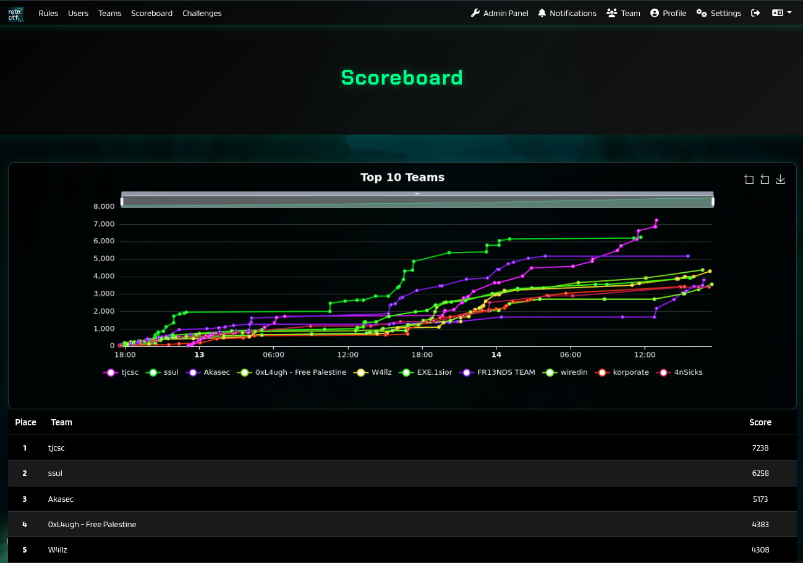
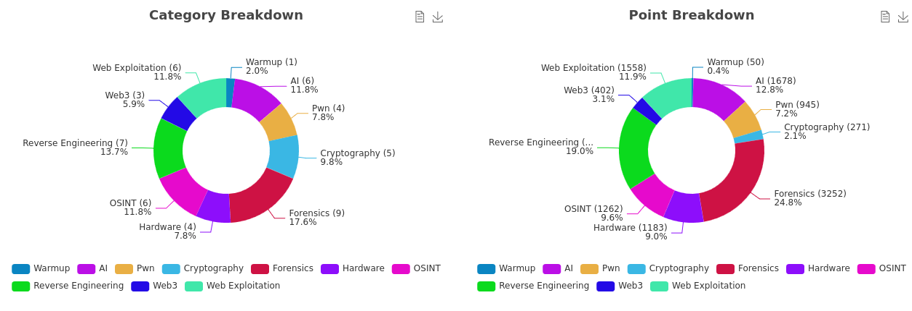
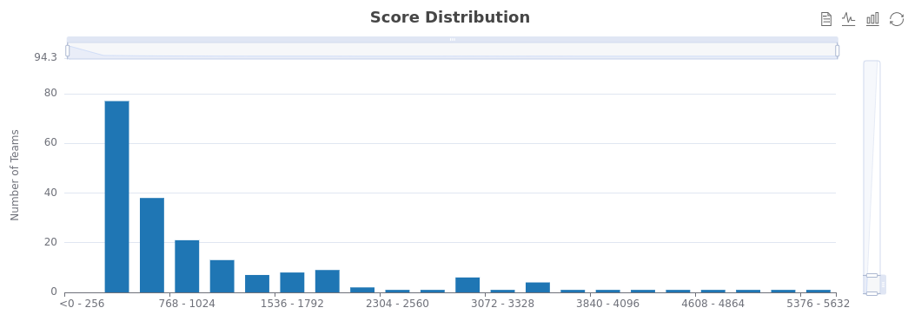
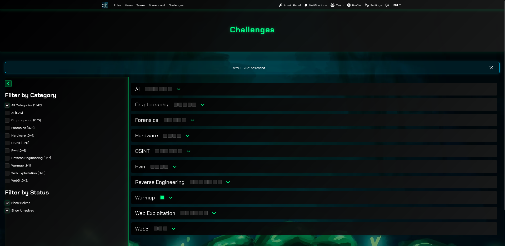

# niteCTF 2025

This repository contains official **source code** and **writeups** for challenges from [niteCTF 2025](https://ctftime.org/event/2851).

### Statistics

| Metric                                  | Value |
| --------------------------------------- | ----- |
| Total Registered Players                | 3744  |
| Total Registered Teams                  | 1622  |
| Teams that solve at least one challenge | 532   |
| Total Number of Challenges              | 50    |

