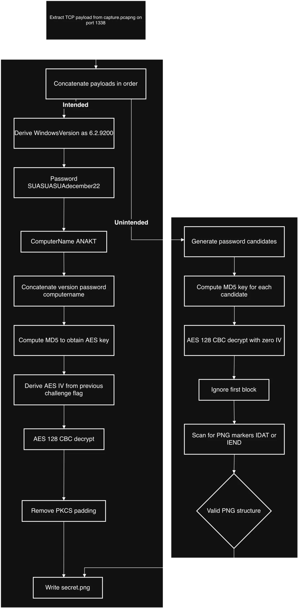
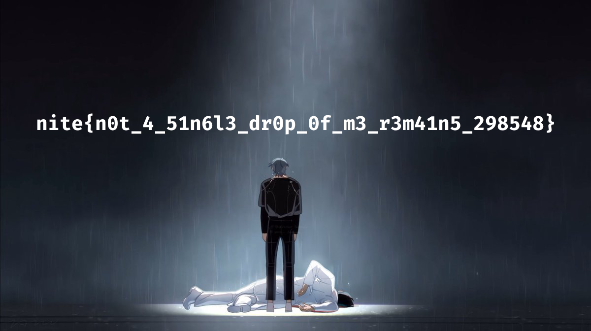

# Incident Response 3: Karma

> Finally. The binary dropped a second payload and established persistence. Find out what its up to.
>
> Handout is the same as the one used to solve My Clematis.

**Authors:** `lvert` `shady`

**Flag:** `nite{n0t_4_51n6l3_dr0p_0f_m3_r3m41n5_298548}`

This stage continues directly from the Wiege solution. The previously executed Rust binary (`hash_encoder.exe`) downloads and runs `caret-ware.exe`, which encrypts a local file (`secret.png`) and transmits it over the network. The goal is to recover the encrypted payload and explain both the intended and unintended solution paths.

First, lets analyze and reverse engineer `chrome.exe`.

## Program Flow

The program starts at `start` (0x403e3f), which calls `WinMain` to initialize the GUI application.

Located at `StartAddress` (0x401c00) is `WinMain`, which performs the following steps:
1. Initializes GDI+ for image rendering
2. Creates a dimmed overlay window covering the entire screen
3. Creates the main UAC-style dialog window
4. Enters the message loop

The password verification process involves several steps:

1. **User Input**: Password is entered in the edit control
2. **Worker Thread**: When "Yes" is clicked, a worker thread is created (`ProcessLogicThread`)
3. **Password Verification**: The thread calls `VerifyPassword()` which:
   - Uses API hashing to resolve `advapi32.dll` functions
   - Decrypts the module name string using XOR key 0xAA
   - Resolves `GetUserNameA` and `LogonUserA` functions
   - Attempts Windows authentication using `LogonUserA` with the entered password
   - Returns TRUE if authentication succeeds

The program uses a custom virtual machine (VM) to obfuscate critical operations:

## VM Architecture
- **Registers**: R0, R1, R2, R3, R4
- **Instruction Pointer**: Points to bytecode instructions
- **Opcode Set**: Custom instruction set

### Opcode Reference Table

| Opcode               | Value   | Description                                 |
| --------             | ------- | -------------                               |
| `VM_LOAD_CONST_R0`   | 0x01    | Load 32-bit constant into R0                |
| `VM_LOAD_CONST_R1`   | 0x02    | Load 32-bit constant into R1_val            |
| `VM_LOAD_CONST_R2`   | 0x03    | Load 32-bit constant into R2                |
| `VM_LOAD_BYTE_R2_R1` | 0x04    | Load byte from memory address in R1 into R2 |
| `VM_OR_R2_CONST`     | 0x05    | Bitwise OR R2 with 32-bit constant          |
| `VM_XOR_R0_R2`       | 0x06    | XOR R0 with R2                              |
| `VM_MUL_R0_CONST`    | 0x07    | Multiply R0 by 32-bit constant              |
| `VM_INC_R1`          | 0x08    | Increment R1 pointer                        |
| `VM_JZ_R2_OFFSET`    | 0x09    | Jump if R2 is zero (signed 16-bit offset)   |
| `VM_RET_R0`          | 0x0A    | Return R0 as result                         |
| `VM_JMP_OFFSET`      | 0x0B    | Unconditional jump (signed 16-bit offset)   |
| `VM_LOAD_CONST_R3`   | 0x0C    | Load 32-bit constant into R3                |
| `VM_LOAD_CONST_R4`   | 0x0D    | Load 32-bit constant into R4                |
| `VM_AND_R0_R2`       | 0x10    | Bitwise AND R0 with R2                      |
| `VM_NOT_R2`          | 0x11    | Bitwise NOT of R2                           |
| `VM_ADD_R0_R2`       | 0x12    | Add R2 to R0 (32-bit wrap)                  |
| `VM_ROL_R0_CONST`    | 0x13    | Rotate R0 left by 8-bit constant            |
| `VM_XOR_R0_R1`       | 0x14    | XOR R0 with R1_val                          |


The VM instructions are encrypted and stored in `vm_instructions_encrypted[]`:
- **Seed**: `THIS_IS_FOR_R7`
- **Decryption Process**:
  1. Execute VM PRNG with seed to get initial state
  2. For each byte in encrypted instructions:
     - Generate keystream byte using VM PRNG with seed+state+index
     - XOR encrypted byte with keystream byte
     - Update state using VM PRNG with seed+index

The VM is used to implement a hash function (`HashStringFNV1A`):
- Takes a string input
- Executes VM bytecode to compute a hash value
- Used for API hashing (resolving module and function names)

## VM Disassembly and Pseudocode

The VM PRNG is defined by the following bytecode:

```
0000: LOAD_CONST_R0        0x8E3F9A2D
0005: LOAD_CONST_R1        0x4C7B2E1F
000A: LOAD_CONST_R3        0x2A5D8C3B
L000F:
000F: LOAD_BYTE_R2_R1
0010: JZ_R2_OFFSET         16 (-> 0023)
0013: XOR_R0_R2
0014: ADD_R0_R2
0015: ROL_R0_CONST         5
0017: XOR_R0_R1
0018: ROL_R0_CONST         3
001A: XOR_R0_R2
001B: ADD_R0_R2
001C: ROL_R0_CONST         7
001E: XOR_R0_R1
001F: INC_R1
0020: JMP_OFFSET           -20 (-> 000F)
L0023:
0023: RET_R0
```

The pseudocode for the PRNG is as follows:
```
function prng(input_str):
    R1 = input_str
    R0 = 0x8E3F9A2D
    R1_val = 0x4C7B2E1F
    R3 = 0x2A5D8C3B
L1:
    R2 = (BYTE)*R1
    if R2 == 0: goto L0
    R0 = R0 ^ R2
    R0 = (R0 + R2) & 0xFFFFFFFF
    R0 = ROL(R0, 5)
    R0 = R0 ^ R1_val
    R0 = ROL(R0, 3)
    R0 = R0 ^ R2
    R0 = (R0 + R2) & 0xFFFFFFFF
    R0 = ROL(R0, 7)
    R0 = R0 ^ R1_val
    R1++
    goto L1
L0:
    return R0
```

The VM-based hash function is defined by the following bytecode:
```
0000: LOAD_CONST_R0        0xA3F2C8D1
0005: LOAD_CONST_R1        0x7B9E4A2F
000A: LOAD_CONST_R3        0x5D1C8B3E
L000F:
000F: LOAD_BYTE_R2_R1
0010: JZ_R2_OFFSET         25 (-> 002C)
0013: OR_R2_CONST          0x00000020
0018: XOR_R0_R2
0019: ADD_R0_R2
001A: ROL_R0_CONST         11
001C: XOR_R0_R1
001D: ROL_R0_CONST         7
001F: XOR_R0_R2
0020: ADD_R0_R2
0021: ROL_R0_CONST         15
0023: XOR_R0_R1
0024: ROL_R0_CONST         12
0026: XOR_R0_R2
0027: ADD_R0_R2
0028: INC_R1
0029: JMP_OFFSET           -29 (-> 000F)
L002C:
002C: RET_R0
```

The pseudocode for the hash function is as follows:
```
function hash(input_str):
    R1 = input_str
    R0 = 0xA3F2C8D1
    R1_val = 0x7B9E4A2F
    R3 = 0x5D1C8B3E
L1:
    R2 = (BYTE)*R1
    if R2 == 0: goto L0
    R2 = R2 | 0x00000020
    R0 = R0 ^ R2
    R0 = (R0 + R2) & 0xFFFFFFFF
    R0 = ROL(R0, 11)
    R0 = R0 ^ R1_val
    R0 = ROL(R0, 7)
    R0 = R0 ^ R2
    R0 = (R0 + R2) & 0xFFFFFFFF
    R0 = ROL(R0, 15)
    R0 = R0 ^ R1_val
    R0 = ROL(R0, 12)
    R0 = R0 ^ R2
    R0 = (R0 + R2) & 0xFFFFFFFF
    R1++
    goto L1
L0:
    return R0
```

Notes:

- The PRNG VM is used to decrypt the hash function VM instructions
- Both VMs use a similar structure: initialize constants, loop through input string, perform hash operations
- ROL = Rotate Left (circular shift)

### API Hashing

The program uses hash-based API resolution to avoid direct imports. This technique makes static analysis more difficult since function and module names are never directly referenced in the binary.

#### PEB Walking (Process Environment Block)

In `GetModuleBaseByHash` at 0x4014E0:

1. **Accessing the PEB**:
   ```c
   #ifdef _WIN64
       peb = (PPEB)__readgsqword(0x60);  // PEB offset in x64
   #else
       peb = (PPEB)__readfsdword(0x30);  // PEB offset in x86
   #endif
   ```
   - Uses CPU-specific segment registers to access the PEB
   - x64: GS register at offset 0x60
   - x86: FS register at offset 0x30
   - This avoids calling any API functions

2. **PEB Structure Navigation**:
   ```c
   PPEB_LDR_DATA ldr = peb->Ldr;
   PLIST_ENTRY listEntry = ldr->InLoadOrderModuleList.Flink;
   ```
   - Accesses `PEB->Ldr` to get the loader data structure
   - `InLoadOrderModuleList` is a doubly-linked list of all loaded modules
   - Each entry is a `LDR_DATA_TABLE_ENTRY` structure

3. **Module Enumeration Loop**:
   ```c
   while (listEntry != &ldr->InLoadOrderModuleList) {
       PLDR_DATA_TABLE_ENTRY entry = CONTAINING_RECORD(listEntry,
           LDR_DATA_TABLE_ENTRY, InLoadOrderLinks);

       // Convert Unicode module name to lowercase ASCII
       char dllName[256] = { 0 };
       for (int i = 0; i < entry->BaseDllName.Length / sizeof(WCHAR); i++) {
           dllName[i] = (char)(entry->BaseDllName.Buffer[i] | 0x20);
       }

       // Hash the module name
       DWORD currentHash = HashStringFNV1A(dllName);
       if (currentHash == moduleHash) {
           return entry->DllBase;  // Found the module!
       }

       listEntry = listEntry->Flink;  // Move to next module
   }
   ```

4. **Key Points**:
   - Iterates through ALL loaded modules (including ntdll.dll, kernel32.dll, etc.)
   - Converts Unicode module names to lowercase ASCII (bitwise OR with 0x20)
   - Uses VM-based hash function to compute module name hash
   - Compares computed hash with target hash
   - Returns module base address when match is found

Implementation in `GetProcAddressByHash` at 0x4015E0:

1. **PE Header Parsing**:
   ```c
   PIMAGE_DOS_HEADER dosHeader = (PIMAGE_DOS_HEADER)moduleBase;
   if (dosHeader->e_magic != IMAGE_DOS_SIGNATURE) return NULL;

   PIMAGE_NT_HEADERS ntHeaders = (PIMAGE_NT_HEADERS)
       ((PBYTE)moduleBase + dosHeader->e_lfanew);
   if (ntHeaders->Signature != IMAGE_NT_SIGNATURE) return NULL;
   ```
   - Validates DOS header (MZ signature)
   - Locates NT headers (PE signature)
   - Both x86 and x64 variants are handled

2. **Export Directory Access**:
   ```c
   IMAGE_DATA_DIRECTORY exportDir =
       ntHeaders->OptionalHeader.DataDirectory[IMAGE_DIRECTORY_ENTRY_EXPORT];

   if (!exportDir.VirtualAddress) return NULL;

   PIMAGE_EXPORT_DIRECTORY exportDirectory =
       (PIMAGE_EXPORT_DIRECTORY)((PBYTE)moduleBase + exportDir.VirtualAddress);
   ```
   - Accesses the export directory from the PE data directory array
   - Export directory contains all exported function information

3. **Function Name Enumeration**:
   ```c
   PDWORD addressOfFunctions = (PDWORD)((PBYTE)moduleBase +
       exportDirectory->AddressOfFunctions);
   PDWORD addressOfNames = (PDWORD)((PBYTE)moduleBase +
       exportDirectory->AddressOfNames);
   PWORD addressOfNameOrdinals = (PWORD)((PBYTE)moduleBase +
       exportDirectory->AddressOfNameOrdinals);

   for (DWORD i = 0; i < exportDirectory->NumberOfNames; i++) {
       const char* functionName = (const char*)((PBYTE)moduleBase +
           addressOfNames[i]);

       // Hash the function name
       if (HashStringFNV1A(functionName) == functionHash) {
           WORD ordinal = addressOfNameOrdinals[i];
           DWORD functionRVA = addressOfFunctions[ordinal];
           return (PVOID)((PBYTE)moduleBase + functionRVA);
       }
   }
   ```

4. **Hash Comparison Process**:
   - Iterates through all exported function names
   - Hashes each function name using the VM-based hash function
   - Compares computed hash with target function hash
   - When match found, uses ordinal to get function RVA
   - Returns absolute address (base + RVA)

**Known Function Hashes**:
- `GetUserNameA`: 0xE80FBD9D (from advapi32.dll)
- `LogonUserA`: 0x711F1AD5 (from advapi32.dll)
- `GetVersionEx`: 0x889877CE (from kernel32.dll)
- `GetComputerNameA`: 0x76B1AEBC (from kernel32.dll)

#### GetVersionEx and GetComputerName Usage

**Implementation in ProcessLogicThread**:

1. **Resolving kernel32.dll**:
   ```c
   char moduleName[] = { /* XOR-encrypted "kernel32.dll" */ };
   DecryptString(moduleName, sizeof(moduleName), 0xAA);
   DWORD kernel32Hash = HashStringFNV1A(moduleName);
   PVOID kernel32Base = GetModuleBaseByHash(kernel32Hash);
   ```
   - Decrypts "kernel32.dll" string (XOR key 0xAA)
   - Hashes the module name
   - Uses PEB walking to find kernel32.dll base address

2. **Resolving GetVersionEx**:
   ```c
   const DWORD GETVERSIONEX_HASH = 0x889877CE;
   pGetVersionEx GetVersionExFunc = (pGetVersionEx)
       GetProcAddressByHash(kernel32Base, GETVERSIONEX_HASH);
   ```
   - Uses function hashing to resolve `GetVersionEx`
   - Hash value: 0x889877CE

3. **Getting Windows Version**:
   ```c
   OSVERSIONINFOEX verInfo = { 0 };
   verInfo.dwOSVersionInfoSize = sizeof(verInfo);
   GetVersionExFunc((OSVERSIONINFO*)&verInfo);

   char versionString[256];
   sprintf(versionString, "%lu.%lu.%lu",
       verInfo.dwMajorVersion,
       verInfo.dwMinorVersion,
       verInfo.dwBuildNumber);
   ```
   - Retrieves Windows version information
   - Formats as "major.minor.build" (e.g., "10.0.19041")
   - This string becomes part of the encryption key

4. **Resolving GetComputerName**:
   ```c
   const DWORD GETCOMPUTERNAME_HASH = 0x76B1AEBC;
   pGetComputerNameA GetComputerNameFunc = (pGetComputerNameA)
       GetProcAddressByHash(kernel32Base, GETCOMPUTERNAME_HASH);
   ```
   - Uses function hashing to resolve `GetComputerNameA`
   - Hash value: 0x76B1AEBC

5. **Getting Computer Name**:
   ```c
   char computerName[MAX_COMPUTERNAME_LENGTH + 1];
   DWORD computerNameLen = MAX_COMPUTERNAME_LENGTH + 1;
   GetComputerNameFunc(computerName, &computerNameLen);
   ```
   - Retrieves the computer's NetBIOS name
   - This also becomes part of the encryption key

6. **Key Material Combination**:
   ```c
   size_t combinedLen = strlen(versionString) + passwordLen + strlen(computerName);
   char* combined = (char*)malloc(combinedLen + 1);
   sprintf(combined, "%s%s%s", versionString, password, computerName);

   BYTE md5Hash[16];
   DWORD md5Len = 16;
   MD5Hash(combined, combinedLen, md5Hash, &md5Len);
   ```
   - Combines: `WindowsVersion + Password + ComputerName`
   - Example: "10.0.19041MyPassword123DESKTOP-ABC"
   - Computes MD5 hash of the combined string
   - **This MD5 hash becomes the AES encryption key**

**Example Key Generation**:
```
Input: "10.0.19041" + "MyPass123" + "DESKTOP-ABC"
Combined: "10.0.19041MyPass123DESKTOP-ABC"
MD5: [16-byte hash]
AES Key: [MD5 hash used as 128-bit AES key]
```

### File Processing Flow

1. **System Information Collection**:
   - Resolves `kernel32.dll` using PEB walking (see PEB Walking section)
   - Resolves `GetVersionEx` using function hashing (hash: 0x889877CE)
   - Resolves `GetComputerNameA` using function hashing (hash: 0x76B1AEBC)
   - Gets Windows version using `GetVersionEx` (see GetVersionEx/GetComputerName section)
   - Gets computer name using `GetComputerNameA` (see GetVersionEx/GetComputerName section)
   - Combines: `version + password + computername`

2. **Key Generation**:
   - Computes MD5 hash of combined string (see GetVersionEx/GetComputerName section for details)
   - Uses MD5 as AES encryption key (128-bit key)

3. **IV Generation**:
   - Downloads data from: https://github.com/luka-4evr/my-saviour/raw/refs/heads/main/part2.txt
   - Base64 decodes the downloaded data
   - XOR decrypts with key "ETIN"
   - Computes MD5 hash of decrypted data
   - Uses MD5 as AES IV

4. **File Encryption**:
   - Reads `secret.png` from current directory
   - Encrypts file using AES-128-CBC with generated key and IV
   - Pads to 16-byte boundary

5. **Data Transmission**:
   - Sends encrypted data to `127.0.0.1:1338` via TCP socket

Now, back to analyzing the VM again.

1. While enumerating the VM filesystem, a deleted packet capture file is found in the Recycle Bin: `capture.pcapng`.
2. Inspecting the capture reveals a TCP stream to `127.0.0.1:1338`.
3. Reassembling the TCP payload shows a raw binary stream consistent with encrypted file data. This matches the behavior identified in Wiege, where `caret-ware.exe` sends AES-encrypted output to port `1338`.

Thus we can safely conclude `capture.pcapng` contains the encrypted form of `secret.png`.

From reversing `caret-ware.exe`, the encryption scheme is fully identified:

- Cipher: AES-128-CBC
- Key size: 128 bits
- Block size: 16 bytes

### Key derivation

The AES key is:

$$K = MD5(WindowsVersion | Password | ComputerName)$$

The binary calls `GetVersionEx`. Due to WinAPI behavior, if no application manifest is present, Windows reports itself as Windows 8. I recently found out about this quirk through this tweet: https://x.com/yarden_shafir/status/1989190499417346441.

So WindowsVersion = "6.2.9200".

> [!NOTE]
> Many tickets we recieved assumed Windows 10 versioning (10.0.xxxx), but this is incorrect without a manifest.

Now for the password. In the VM find a document, `important.docx` in the `C:\Users\Mizi\Documents\` folder, with hundreds of passwords in it.

One of them says: "Windows: SUASUASUA + her birthday (month and day)".

Through OSINT, the password string is identified as: `SUASUASUAdecember22`

This is a reference to the character Sua from Alien Stage, the web series these chals are based on, whose birthday is December 22: https://alienstage.fandom.com/wiki/Sua

Finally, the computer name is retrieved from the VM settings. It is set to `ANAKT`.

Combining all components: KeyMaterial is `6.2.9200SUASUASUAdecember22ANAKT`

Final key: $$K = MD5(KeyMaterial)$$

## IV Derivation

The AES-CBC IV is not random. It is deterministically derived from the previous challenge flag: `nite{1nsp1r3d_by_he_H3_xD_xqvylj8rtap8}`

This creates a fixed, predictable IV tied to the challenge progression.

Now to solve the final payload and decrypt the data given in `capture.pcapng`.

## Intended Solve

The intended solution uses full knowledge of both the key and IV.

Steps:

1. Extract all TCP payload bytes from `capture.pcapng` for port `1338`.
2. Concatenate payloads in transmission order.
3. Derive:
    - AES key using the MD5 formula above
    - AES IV from the previous flag
4. Decrypt using AES-128-CBC.
5. Remove PKCS padding.
6. Write the recovered plaintext to disk as `secret.png`.

This process is implemented in `solve.py` and results in a valid PNG file containing the final flag.

## The Unintended Solve

Now for the fun part. There is an unintended solution path that leverages a cryptographic weakness in AES-CBC mode. It was graciously told to me in a ticket by the user **[s3asick5s](https://ctftime.org/user/211651)** from the team **3HLD**. Unfortunately for them, they weren't able to get the solve for Wiege, so they couldn't progress to this stage. But their insight is invaluable.

### CBC decryption property

For AES-CBC decryption:

$$P_0 = D_K(C_0) \oplus IV$$ and $$P_i = D_K(C_i) \oplus C_{i-1}, \quad i \ge 1$$

If the IV is incorrect or unknown:
- Only the first plaintext block $$P_0$$ is corrupted
- All subsequent blocks $$P_i$$ for $$i \ge 1$$ decrypt correctly

### Practical exploitation

1. The encrypted file is known to be a PNG.
2. PNG files contain fixed chunk markers such as:
    - `IHDR`
    - `IDAT`
    - `IEND`
3. Even if the first 16 bytes are corrupted, later blocks still contain valid PNG chunk signatures.

### Brute-force strategy

1. Guess candidate passwords using template: $$6.2.9200 | SUASUASUA - month - day | ANAKT$$
2. For each candidate:
    - Compute MD5 key
    - Decrypt with AES-CBC using an all-zero IV
3. Scan decrypted output for `IDAT` or `IEND` markers beyond the first block

Once a valid PNG structure is detected, the correct key is recovered, even without knowing the IV.

This works because CBC mode provides no integrity protection and leaks plaintext structure under partial correctness.

### Diagram



## Final Payload Recovery

Using either method:

- Intended: exact key and IV
- Unintended: CBC structural weakness

The decrypted file yields readable PNG data. Extracting embedded text reveals the final flag:

```
nite{n0t_4_51n6l3_dr0p_0f_m3_r3m41n5_298548}
```



## Conclusion

This final stage ties together:

- Reverse engineering
- OSINT
- Windows internals
- Cryptographic design flaws

Key takeaways:

- `GetVersionEx` lies without a manifest
- Deterministic IVs break CBC security assumptions
- File format magic bytes can act as a decryption oracle

Challenge Source Code:

- [Solve script](solve.py)
- [Unintended solve script](unintended_solve.py)
- [chrome.exe source code](caret-ware.cpp)
- [capture.pcapng](capture.pcapng)

