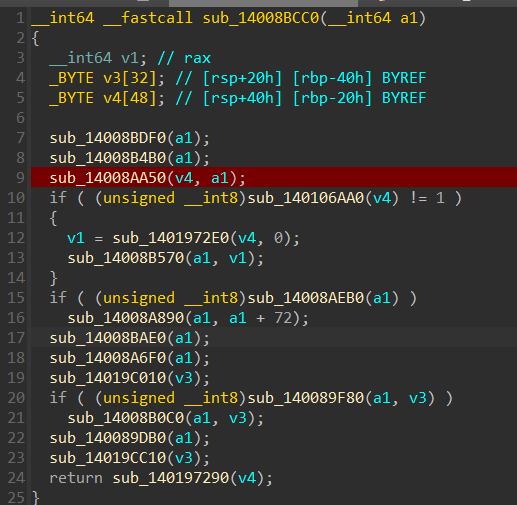

# Ophelia's Truth 3

> Igor discovers that the missing file was actually CCTV footage related to the case surrounding his mother's death. With this revelation, the investigation now shifts toward the dropper. Your task is to determine what the dropper does and recover the missing file. After extensive efforts by the cyber forensics department, they have successfully recovered an uncorrupted version of the dropper, and it has now been provided to you for analysis. Find:
> - The name of the file that went missing
> - Name of the file where its now hidden
> - Size of the original file in bytes
> - Number of frames in the original file
> - Dimensions of the original file
>
> Along with the challenge file from Ophelia's Truth 1, the attached file is also required to solve the challenge.
>
> `Note: The binary is a live malware, please exercise caution.`
>
> File Link: https://drive.proton.me/urls/J88R557TTW#ZYm4lTfXFEOS
>
> Password: infected
>
> Flag format: nite{cctv_footage_file.ext_hidden_file.ext_12345_12345_12345X12345}

**Author:** `Indrath`

**Flag:** `nite{20250627_103005_CAM01.avi_thumbcache_777.db_483596_128_1280X720}`

Upon decompiling the given executable, we can see that it does the following:

- The malware iterates through the user's `%USERPROFILE%\Videos` directory. It specifically searches for a file named `20250627_103005_CAM01.avi`.
- Once found, the file moved and encrypted. The malware reads the video file, encrypts it, and saves it to: `%LOCALAPPDATA%\Microsoft\Windows\Explorer\thumbcache_777.db`. The original video file is then deleted.

- To ensure continued access, the malware establishes persistence by hijacking a legitimate application. It modifies the **Image File Execution Options (IFEO)** registry key for `AcroRd32.exe` (Adobe Acrobat Reader) and sets dropped payload as "Debugger" So every time the user opens a PDF, Windows checks this registry key and launches the "Debugger" (our malware).

- The malware statically links the **Crypto++** library. Then the `.avi` file is encrypted using DES in ECB mode. The key is hardcoded in the binary. The key happens to be `6B 73 79 70 75 6E 6E 0B`.

To get the key, one can take advantage of a peculiar thing the binary does. You will see that `sub_14008BDF0` is where all the paths are initialized, with the `wct*.tmp` path (AES key path) also being initialized in the same function. This function gets called in `sub_14008BCC0` and it can be seen that the same path is used to store the AES key as well as the DES key.

First the DES key gets stored via `sub_14008B4B0` and then later the AES key gets stored in the same path via `sub_14008A6F0`. So if we set up a breakpoint after `sub_14008B4B0` and run it in a VM, we can get the key.



Now you can run it and look for files of size 8 bytes (as we know thats the size of the DES key)
```bash
find './AppData/Local/Temp' -maxdepth 1 -name "wct*.tmp" -size 8c
./AppData/Local/Temp/wctCCD7.tmp

xxd './AppData/Local/Temp/wctCCD7.tmp'
00000000: 6b73 7970 756e 6e0b                      ksypunn.
```

Now we know that the encrypted file is stored as `thumbcache_777.db`, lets try filescan on it:
```bash
 python vol.py -f ophelia.raw windows.filescan.FileScan | grep thumbcache

0xc201a3dc8910.0\Users\Igor\AppData\Local\Microsoft\Windows\Explorer\thumbcache_777.db
0xc201a485c900  \Windows\System32\thumbcache.dll
0xc201a485dd50  \Users\Igor\AppData\Local\Microsoft\Windows\Explorer\thumbcache_16.db
0xc201a485ecf0  \Users\Igor\AppData\Local\Microsoft\Windows\Explorer\thumbcache_idx.db
0xc201a4868480  \Users\Igor\AppData\Local\Microsoft\Windows\Explorer\thumbcache_48.db
0xc201a486c490  \Users\Igor\AppData\Local\Microsoft\Windows\Explorer\thumbcache_256.db
0xc201a4b7ec60  \Users\Igor\AppData\Local\Microsoft\Windows\Explorer\thumbcache_32.db
```

Now we can try dumping, but again just like the key file in the last challenge, it won't work so we need to look for an alternative. The trick here is to look for common bytes in `avi` files, decrypt accordingly, then search for the encrypted bytes in the dump.

There are a bunch of common bytes, for eg - `RIFF`, `AVI` (the file signatures) but DES requires 8 byte blocks so we need longer sequence of bytes such as `hdrlavih8`, `strlstrh8`, etc. The longer sequence of bytes is not universal but very common and should be worth a try.

But the logical thing to try is encrypt `AVI LIST` as LIST is what is used to list the chunks of the AVI file and is usually what follows after the AVI header.

The encrypted hex of `AVI LIST` is `85 88 5b ac 9f f4 75 5d`.

Now lets search for these hex in the dump.
```
xxd ophelia.raw | grep -E '8588 5bac 9ff4 755d' -A 10 -B 1

1b78ca850: 0000 0000 0000 0000 0000 0000 46b5 b743  ............F..C
1b78ca860: c23d 31ea 8588 5bac 9ff4 755d 85c8 477c  .=1...[...u]..G|
1b78ca870: 48fc 856f 905f d1a5 576b 6ad2 d243 9825  H..o._..Wkj..C.%
1b78ca880: e5a9 de74 d3bb 0dcd 3bb1 a3bb 5b05 4acd  ...t....;...[.J.
1b78ca890: 5875 b3cc c036 bc41 ec10 9eef f838 748d  Xu...6.A.....8t.
1b78ca8a0: 2ab0 4116 1d61 0b3a fcd5 730a 1d61 0b3a  *.A..a.:..s..a.:
1b78ca8b0: fcd5 730a 3ee3 1249 6184 0ce5 f6d4 689b  ..s.>..Ia.....h.
1b78ca8c0: 7e50 38cb b7d9 651d febb fd43 47d7 392a  ~P8...e....CG.9*
1b78ca8d0: f53f d7ea 1d61 0b3a fcd5 730a 74d7 3f5e  .?...a.:..s.t.?^
1b78ca8e0: 5ec4 331d 2757 08a7 33a6 26f0 90b0 b9fb  ^.3.'W..3.&.....
1b78ca8f0: f010 a012 1d61 0b3a fcd5 730a 65dd 0768  .....a.:..s.e..h
1b78ca900: 3ced 1f7a cb8f 16b2 8587 0408 f838 748d  <..z.........8t.
```

Voila!
```
1b78ca860: 46b5 b743 c23d 31ea 8588 5bac 9ff4 755d
                               └──────────────────┘
                               Encrypted "AVI LIST"
```

Now looking at the 8 bytes before the encrypted AVI LIST we get - `46b5 b743 c23d 31ea` which is just `RIFF <file size>`. We can decrypt these 8 bytes to get the size of the avi file.

The bytes `46 b5 b7 43 c2 3d 31 ea` upon decryption is  `82 73 70 70 4 97 7 0`. Which corresponds to `483,588 bytes`. Now this is actually the size of the file post the 8 bye header, so to get the total size we add `8` to `483,588`, thus the total size of the file is `483,596` bytes.


To get the information required for the flag we need to focus on the starting few bytes of the file, then decrypt accordingly. The decrypted file looks something like this:
```
00000000: 5249 4646 0461 0700 4156 4920 4c49 5354  RIFF.a..AVI LIST
00000010: 3812 0000 6864 726c 6176 6968 3800 0000  8...hdrlavih8...
00000020: 3582 0000 a861 0000 0000 0000 1009 0000  5....a..........
00000030: 8000 0000 0000 0000 0100 0000 0000 1000  ................
00000040: 0005 0000 d002 0000 0000 0000 0000 0000  ................
00000050: 0000 0000 0000 0000 4c49 5354 e010 0000  ........LIST....
00000060: 7374 726c 7374 7268 3800 0000 7669 6473  strlstrh8...vids
00000070: 464d 5034 0000 0000 0000 0000 0000 0000  FMP4............
00000080: 0100 0000 1e00 0000 0000 0000 8000 0000  ................
00000090: ddb8 0000 ffff ffff 0000 0000 0000 0000  ................
000000a0: 0005 d002 7374 7266 2800 0000 2800 0000  ....strf(...(...
000000b0: 0005 0000 d002 0000 0100 1800 464d 5034  ............FMP4
000000c0: 0030 2a00 0000 0000 0000 0000 0000 0000  .0*.............
000000d0: 0000 0000 4a55 4e4b 1810 0000 0400 0000  ....JUNK........
000000e0: 0000 0000 3030 6463 0000 0000 0000 0000  ....00dc........

```
To get number of frames we look at bytes at offset `0x30`, we get number of frames as `128`. And at offset `0xd0` we get `0005 0000 d002 0000` which translates to `1280` pixels in height and `720` pixels in width.

Hence, our final flag - `nite{20250627_103005_CAM01.avi_thumbcache_777.db_483596_128_1280X720}`

Challenge Source Code:

- [route.exe Source](route.cpp)

