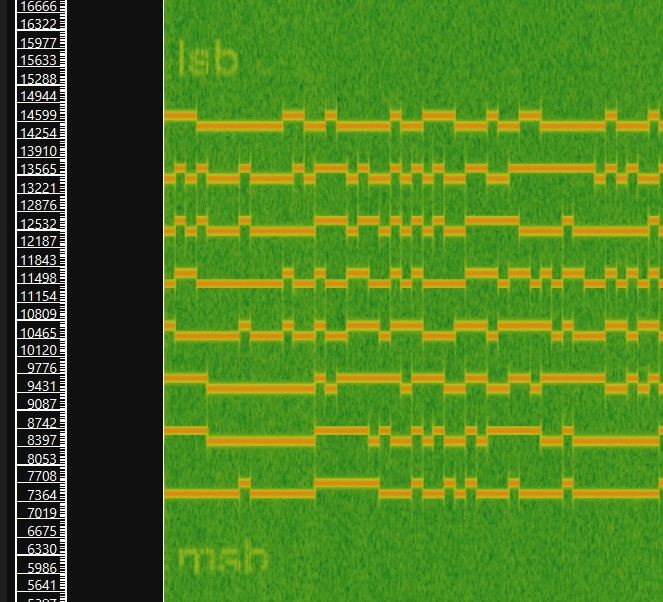
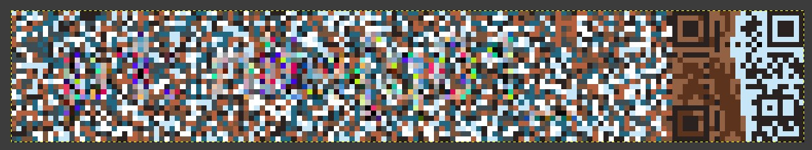
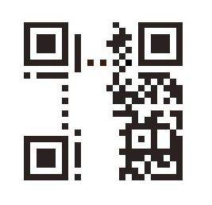
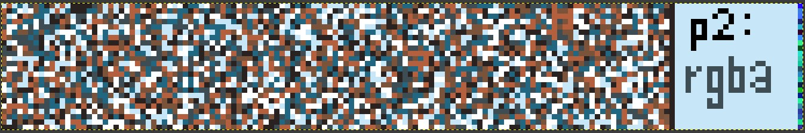
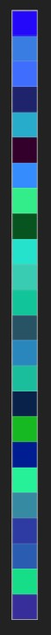
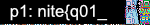
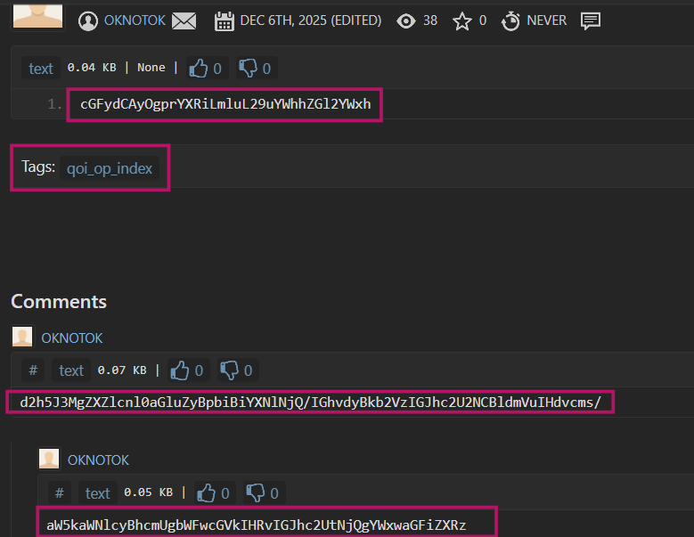

# quite OKNOTOK

> I downloaded a long "binaural" beats audio to help me sleep but it's been of no use.

**Author:** `teayah`

**Flag:** `nite{q01_n0_y0q0an}`

**Handout:** [binaural beats](./binaural_beats)

1. There is no extension given in the audio file, but opening it in hex editor shows `qoaf` which is the header of a [QOA](https://github.com/phoboslab/qoa) file.
2. The repository for QOA can be used to play the QOA file or convert it to another audio file format such as WAV.
3. On playing the audio, there's noise audible along with loud frequency tones.
4. Spectrogram gives a clearer view of this where:
	1. 'msb' and 'lsb' are written below and above the frequencies
	2. there are 8 rows of altering frequencies that change every 0.1s



5. Both of these suggest that it's binary in the form of frequency bins, and so a script would be needed to parse these where each frequency needs to be noted and the change per 0.1s should be considered. The higher frequency would indicate 1 whereas lower indicates 0 in its respective frequency bins.

[Script to turn frequencies into binary](parsefrequencies.py)

6. After parsing the binary string and converting from it, the first few characters are 'qoif' which are of a [QOI](https://github.com/phoboslab/qoi) file. This file can be opened in a software such as GIMP which supports QOI or on an online viewer.



7. The QOI appears to be a noisy pixelated colorful image with one seemingly distorted 25x25 QR code at the right end of it.
8. The QR code can be reconstructed to be decodable by just making the brown ECC pixels white, the light blue to white which leaves us with just the right side of the QR code that has the pixels containing data.



9. These data bits are enough to recover some information and can be done using [QRazyBox](https://merri.cx/qrazybox/)'s "Extract QR Information" Tool which gives `pastebin.com/kdhd1pSD`.

10. Opening this link gives a katb.in link to a base64 string which decodes to another QOI image



11. The QOI is a similarly noisy pixelated image with a similar dimension to the previous QOI but has a **color strip** at the right end indicated by "p2: " and "rgba".



12. It can be combined in a way with the first QOI obtained from the audio such as XOR as theres a few pixels that are colored differently in the first image.
13. XORing the two images with a script or a tool like StegSolve (by first converting both to PNGs) reveals the first part of the flag.



```
p1: nite{q01_
```

****

14. Going back to the pastebin link for part 2, there's also a comment and reply on the pastebin link encoded in base 64



which say:

```
why's everything in base64? how does base64 even work?
> indices are mapped to base-64 alphabets
```

15. The pastebin "**Tags**" section also says: `qoi_op_index`. Searching for this leads to [QOI_(image_format)#Encoding](https://en.wikipedia.org/wiki/QOI_(image_format)#Encoding) which contains an index position formula using rgba values.
16. The idea now is to extract the RGBA values of the color strip, and map them to the base 64 alphabets from these clues. This can be done with a script where:
	1. Python's PIL opens the image as a PNG with the RGBA model
	2. The RGBA values are extracted and substituted into the index hash function `index = (3*r + 5*g + 7*b + 11*a) % 64`, to give decimals in the range 0-63
	3. The base64 character set can be used to map the indices to its character
	4. The derived base64 string can be decoded to give the second part of the flag.

[Script to turn colors into base64](parsecolors.py)

```
part 2: n0_y0q0an}
```

So the final flag is `nite{q01_n0_y0q0an}`.

