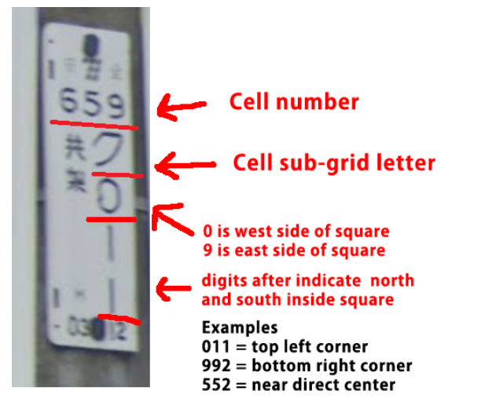
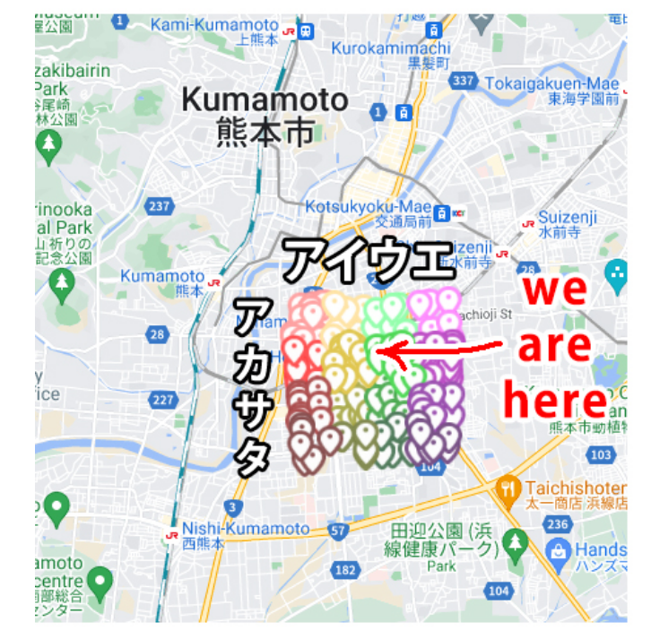

# Bonsai Bankai

**Flag:** `nite{0n_th3_g4rden_0f_brok3n_dr3am5}`

The sign board is slightly a red herring.

The pole is the main clue in this case.

Upon searching, it is a Kyushu plate, and you can check how to read a Kumamoto plate.

Based on this,

You can estimate the location of the picture and get the flag.

The exact location is : [Maps](https://www.google.com/maps/place/Kumamoto,+Japan/@32.7826463,130.7069759,3a,75y,4.92h,91.18t/data=!3m7!1e1!3m5!1sW5H-OOv2kUU0B4Zd_XsuFw!2e0!6shttps:%2F%2Fstreetviewpixels-pa.googleapis.com%2Fv1%2Fthumbnail%3Fcb_client%3Dmaps_sv.tactile%26w%3D900%26h%3D600%26pitch%3D-1.1800000000000068%26panoid%3DW5H-OOv2kUU0B4Zd_XsuFw%26yaw%3D4.92!7i16384!8i8192!4m7!3m6!1s0x3540f414acf11b4f:0x1a51ced19bcf5c31!8m2!3d32.8032164!4d130.7079369!10e5!16zL20vMGdwNl8w?entry=ttu&g_ep=EgoyMDI1MTIwMi4wIKXMDSoASAFQAw%3D%3D)

