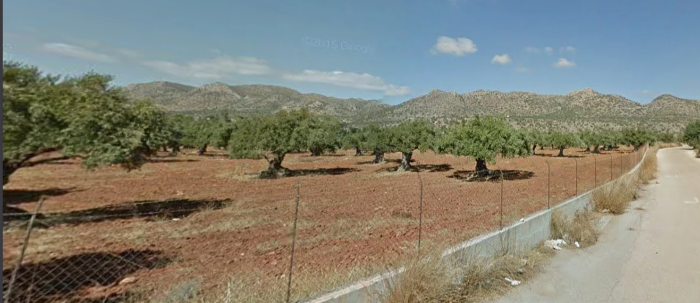
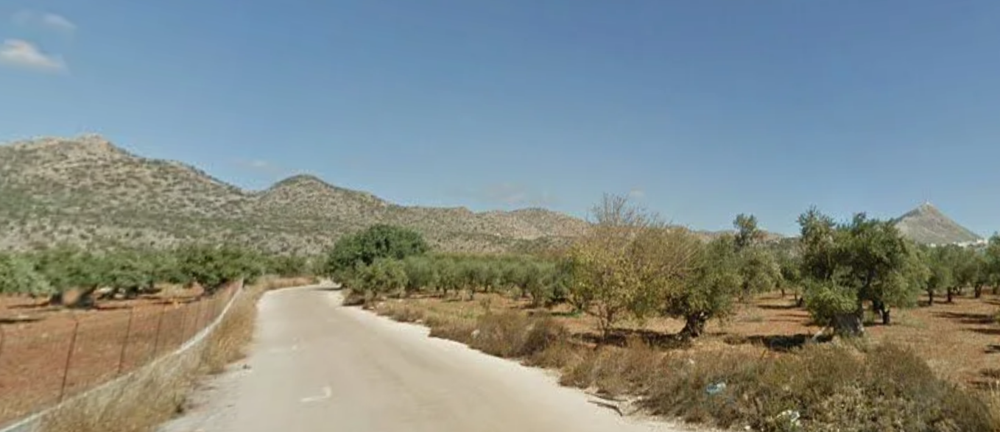

# Hillbilly

**Flag:** `nite{i_d0nt_w4nna_ol1v3_f0rev3r}`

This is a very obscure picture, congratulations if you actually solved it.

Purely based on the landscape, it can be inferred that it is from Greece. The olive grove also gives a hint.

These are hills are found near Akrotiri, Chania, Greece.

[Exact Location](https://www.google.com/maps/@35.555794,24.1335039,3a,75y,189.22h,89.71t/data=!3m7!1e1!3m5!1sLwBKRscIbyguTKfHDluqcA!2e0!6shttps:%2F%2Fstreetviewpixels-pa.googleapis.com%2Fv1%2Fthumbnail%3Fcb_client%3Dmaps_sv.tactile%26w%3D900%26h%3D600%26pitch%3D0.2914605827333361%26panoid%3DLwBKRscIbyguTKfHDluqcA%26yaw%3D189.21553513597053!7i13312!8i6656?entry=ttu&g_ep=EgoyMDI1MTIwMi4wIKXMDSoASAFQAw%3D%3D)
