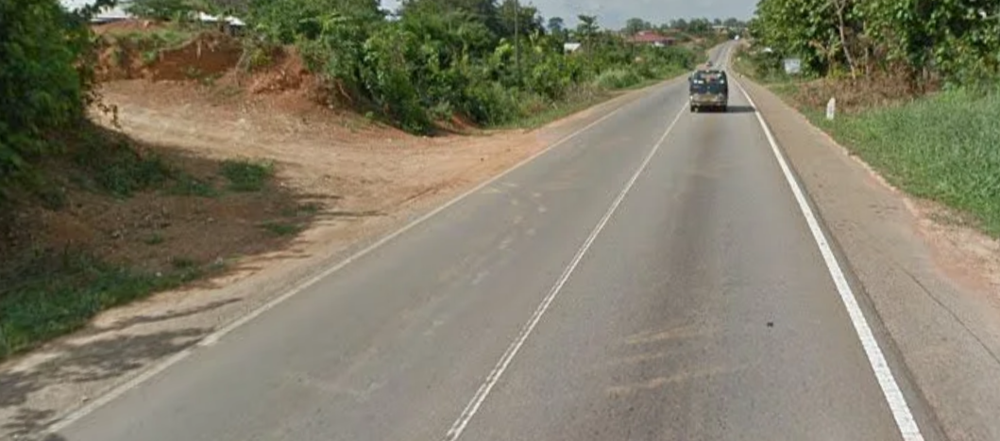
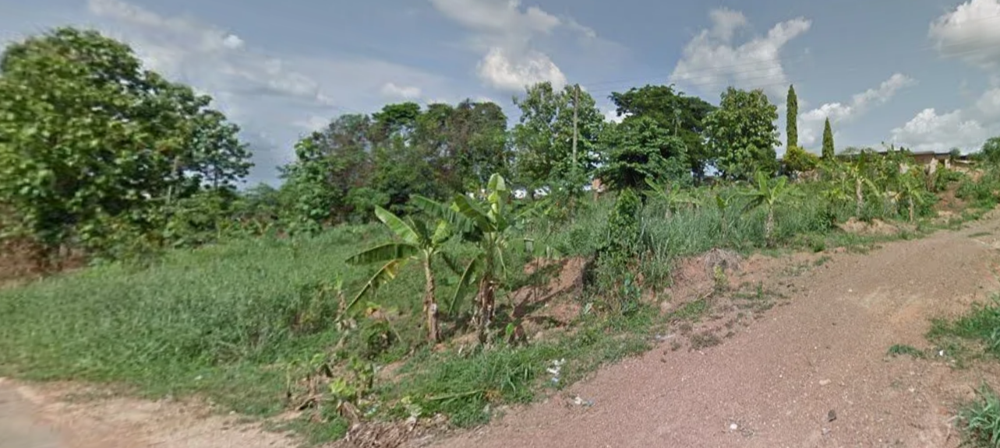
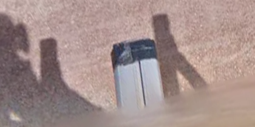
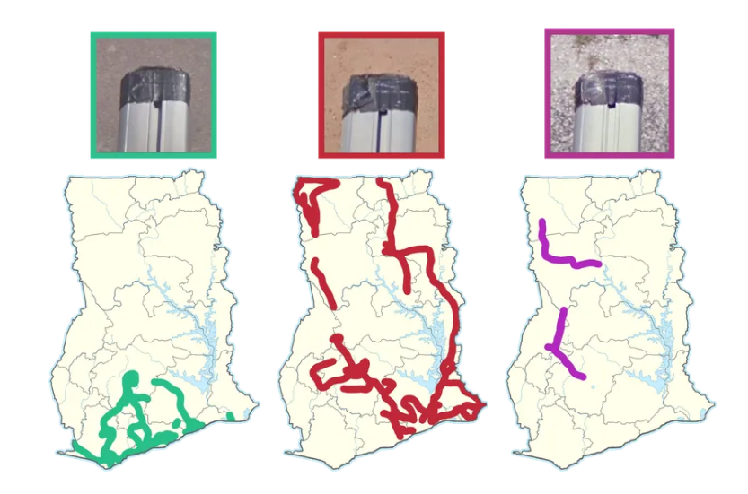

# Road Not Taken

**Flag:** `nite{b4nanas_&nd_se4_sh4nt1es_s0und_n1c3}`

Given the banana plantations, red soil, road and landscape, an inference can be made that it might be from Africa.
Only a few number of African countries are covered by Google which narrows it down.

A crucial but easily missed clue can be the tape on the car.

This is popularly known as the Ghana Car Meta, and upon searching closely,

it can be seen that, the tape matches the first marker here. As it is a highway, the highways can be searched in order to find the exact location. The search might be an extensive one.

[Exact Location](https://www.google.com/maps/@6.5943586,-2.1292477,3a,69.4y,76.2h,82.48t/data=!3m7!1e1!3m5!1saH-ydQ3EUkbNbSTUfn-x5Q!2e0!6shttps:%2F%2Fstreetviewpixels-pa.googleapis.com%2Fv1%2Fthumbnail%3Fcb_client%3Dmaps_sv.tactile%26w%3D900%26h%3D600%26pitch%3D7.5225347977906125%26panoid%3DaH-ydQ3EUkbNbSTUfn-x5Q%26yaw%3D76.19582438460276!7i13312!8i6656?entry=ttu&g_ep=EgoyMDI1MTIwMi4wIKXMDSoASAFQAw%3D%3D)
