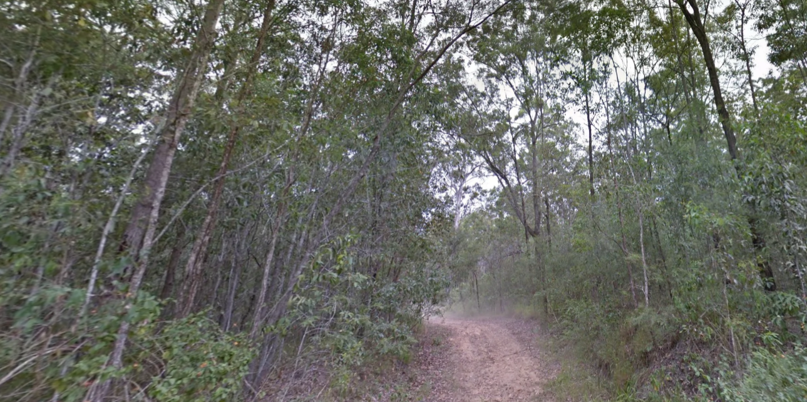
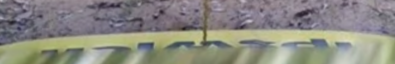
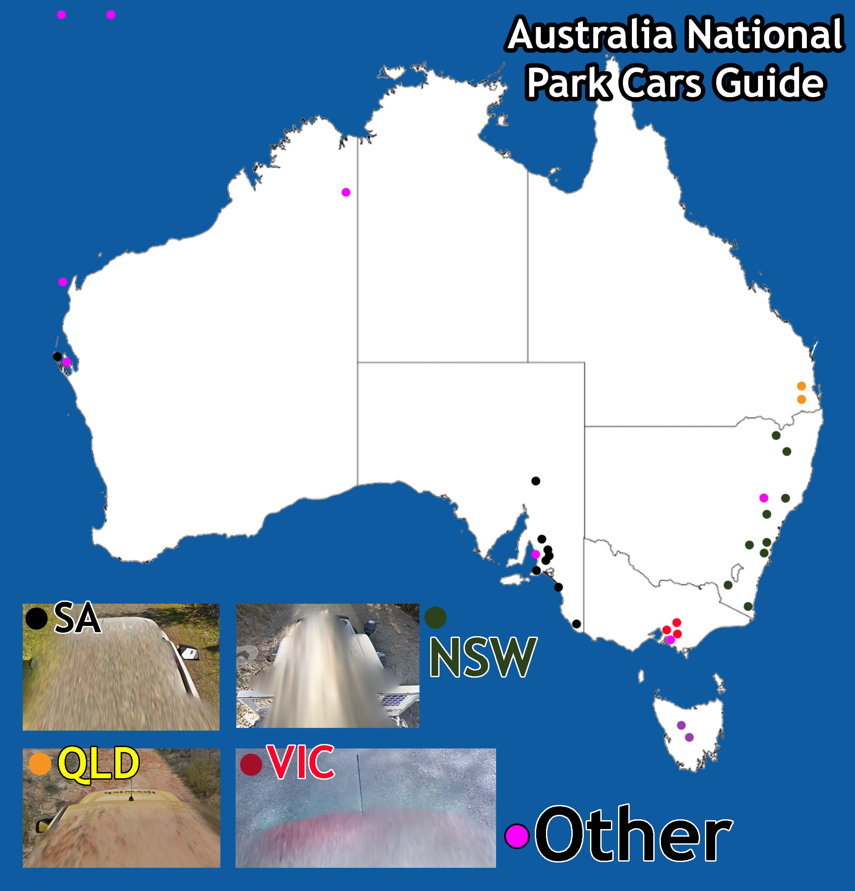

# The Ashes

**Flag:** `nite{w0ah_th4t_wa5_sl1ghtly_0bscur3}`

All which is given is an arid forest in this photo. However, upon looking closely, a part of the Google Street View car is visible.

Some letters can be made out like `_pswic_`. The name can probably mean Ipswich.

Ipswich is a port town in England, however, this is not the case here. Based on the landscape, it looks very dry and arid. Upon further searching, there is an Ipswich in Australia too, which matches the area.

Upon using some choice research tools, we get this.

Roaming around using Google Street View, you can find the exact [location](https://www.google.com/maps/place/27°41'48.1"S+152°53'28.8"E/@-27.7001432,152.8936674,3a,33.6y,24.45h,73.33t/data=!3m7!1e1!3m5!1sL97CL42vVzFuvvaT011udw!2e0!6shttps:%2F%2Fstreetviewpixels-pa.googleapis.com%2Fv1%2Fthumbnail%3Fcb_client%3Dmaps_sv.tactile%26w%3D900%26h%3D600%26pitch%3D16.666293615280352%26panoid%3DL97CL42vVzFuvvaT011udw%26yaw%3D24.451090541293464!7i13312!8i6656!4m4!3m3!8m2!3d-27.6966847!4d152.8913444?entry=ttu&g_ep=EgoyMDI1MTIwMS4wIKXMDSoASAFQAw%3D%3D)
