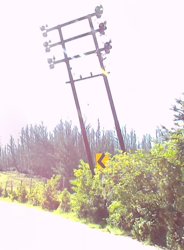

# The Flash

**Flag:** `nite{0oh_1d_l1k3_m3_s0m3_h0t_t3a}`

A high contrast image has been provided.

Upon looking at the image,

The yellow road sign and pole reveal that the country is India.
Upon taking a look around, a hilly region is noticed based on the terrain.
Also, eucalyptus trees are seen in the background. With a quick search, they are found to be growing in the Nilgiris region. This might be Ooty (also known as Udhagamandalam in the map).
Checking Google Street View as the image has been taken from there, and navigating around Ooty, we find that it is from near the golf course.
