# Lament of the Seraph Solution

> Our friendly neighbourhood crypto bro is left lamenting after a ransomware attack wiped his fortune and locked his wallets. What he thought was a gateway to wealth was, in truth, a trap. Among his many missteps, some say he once placed his trust in a public server. Help him undo his folly and seize the flag in the process.
>
> `Note: This is a live malware, please exercise caution.`
>
> Drive Link: https://drive.proton.me/urls/ZD2V8HKZCM#fSqFaLtxBubo
>
> Password: infected

**Author:** Indrath

**Flag**: `nite{CRYPT0BR0Sn4NG3LS4tTH3g4t3}`

We are presented with a 32-bit PE file - `seraphs_lance.exe`

```
file seraphs_lance.exe
seraphs_lance.exe: PE32 executable (console) Intel 80386 (stripped to external PDB), for MS Windows, 9 sections
```

First things first, let's look at its decomp to get an idea of things. Going over the strings, we find a ransom note in `sub_402A22`:

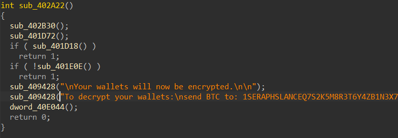

Okay, so we are presented with what looks like a ransomware designed to encrypt crypto wallets. This is a good starting point for us and we can consider this `main` for now, so let's start looking at the functions being called in this function:

### `sub_401D18`

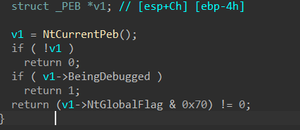

This is a pretty self-explanatory function. The function returns 1 if the binary is being debugged which in turn results in the binary being exited.

### `sub_401E0E`

Now this function calls a couple of hashed Windows API functions.

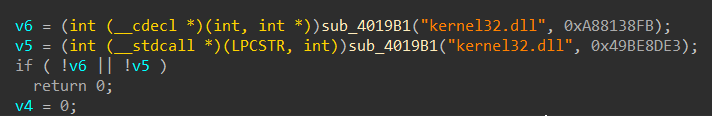

`sub_4019B1` parses the PE Header of the loaded DLL, walks the Export Directory, hashes every function name it finds using `sub_4014E0`, and compares it to the requested hash.

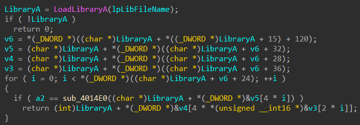

So now we need to look at the hashing algorithm.

### `sub_4014E0`

The hashing algorithm is a modified version of `Salsa20`. The initial state is a 4x4 matrix that's filled with the length of the string passed to the function. It then XORs the string with the string length. Then it uses custom "Nothing-Up-My-Sleeve" constants - "SRPH", "LNCE", "NITE" and "2025" instead of the standard "expa", "nd 3", "2-by", and "te k".

For example, the initial state for `VirtualAlloc` will look something like this:

| | **Col 0** | **Col 1** | **Col 2** | **Col 3** |
| :---: | :---: | :---: | :---: | :---: |
| **Row 0** | `Len` ^ "Virt" ^ "SRPH" | `Len` ^ "ualA" | `Len` ^ "lloc" | `Len` |
| **Row 1** | `Len` | `Len` ^ "LNCE" | `Len` | `Len` |
| **Row 2** | `Len` | `Len` | `Len` ^ "NITE" | `Len` |
| **Row 3** | `Len` | `Len` | `Len` | `Len` ^ "2025" |

The algorithm then runs 4 Double-Rounds. Each Double-Round consists of a Column Round followed by a Row Round. Every transformation mixes four words using ARX. Usually, Salsa20 rotates by 7, 9, 13, 18. This variant rotates by 5, 11, 17, 23.

The algorithm adds the mixed 16-word state back to the original one to break linearity (feed-forward). Then it collapses the 512-bit state by XORing all 16 words together. The final 32-bit XOR result is returned as the hash.


Now a [python script](resolver.py) can be written to resolve the functions with the hashes provided.


### `sub_401E0E` (continued)

After resolving the hashes, the function looks something like this:

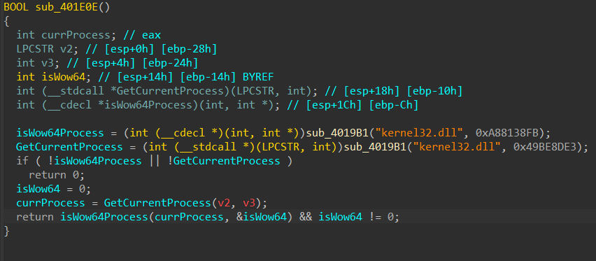

It is now pretty easy to identify what this function is doing - it calls the Windows API function `IsWow64Process` via `kernel32.dll`, this function simply checks if the given process (via `GetCurrentProcess`) is running under `Windows-on-Windows-64-bit`.

### What is WOW64?
 It is a subsystem in 64-bit versions of Windows that allows 32-bit applications to run seamlessly on a 64-bit operating system. This feature is included by default in most 64-bit Windows operating systems.

At this point, you might have guessed what this challenge is about. The binary given tries to execute arbitrary 64-bit code from the given 32-bit PE file. How does it do that? We will look at this later. For now let's move on to the other functions.

### Next up - `sub_416E80`

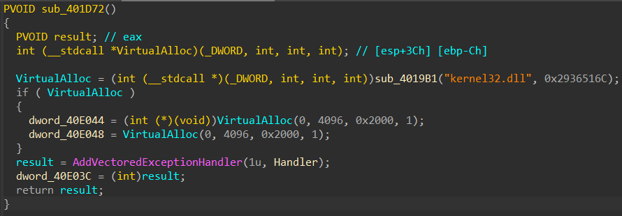

This function simply registers a vectored exception handler named `Handler`. Basically, it prepares memory and an exception hook for later use.


Going back to main, we see `dword_40E044` which is referenced via `Handler`

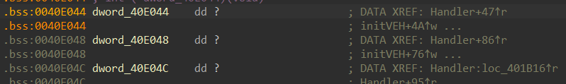

### Next up - `Handler`

This function is a Vectored Exception Handler (VEH). It intercepts application crashes to hijack the CPU's execution path. In this big function, only one part is of interest to us.

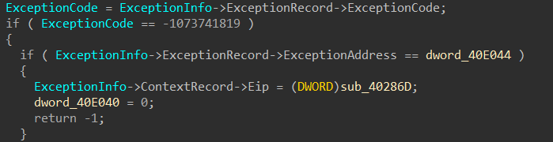

This block handles memory access errors. The ransomware intentionally crashes at specific valid pointers to trigger this block. This is a control-flow obfuscation technique to hide the call to the malicious payload (`sub_40286D`).

If the Exception Address happens to be `dword_40E044` then `sub_40286D` gets called. Here `sub_40286D` is the actual malicious stuff the binary tries to do.


### Next up - `sub_40286D`

We can see that this function calls two functions of interest - `sub_401FD1` and `sub_401E9D`.

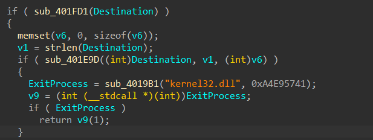

### `sub_401FD1`

The function will look something like this after resolving the hashes:

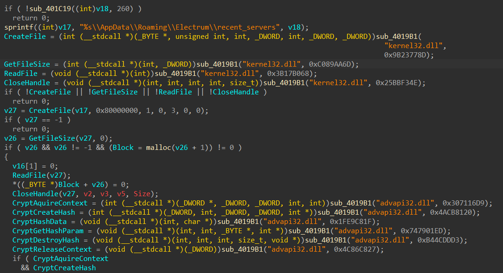

Here `sub_401C19` gets the `USERPROFILE` path via PEB walking, which then builds the path to `\\AppData\\Roaming\\Electrum\\recent_servers`. The function then parses this file and looks for a string between double quotes whose md5 hash matches `5fc44255053d10f73c65104fa689843f`.

Now, it is impossible to get the string from the md5 hash alone, this is where the description comes in which hints at a `public server`. The intent behind this part is for the player to research on well known public `Electrum` servers and `Electrum` as a whole. The required string is `electrum.blockstream.info` which can be found in https://github.com/spesmilo/electrum/blob/0eefcbae9cb19ff9ece8cd07dc97f8835b690b83/electrum/chains/mainnet/servers.json or https://1209k.com/bitcoin-eye/ele.php

Upon passing the md5 check, the string is returned via `Destination`.

### Next up - `sub_401E9D`

The string stored in `Destination` is now passed to this function. We additionally see that `VirtualProtect` is used in this function, now we can make an educated guess that some shellcode is being executed in this function.

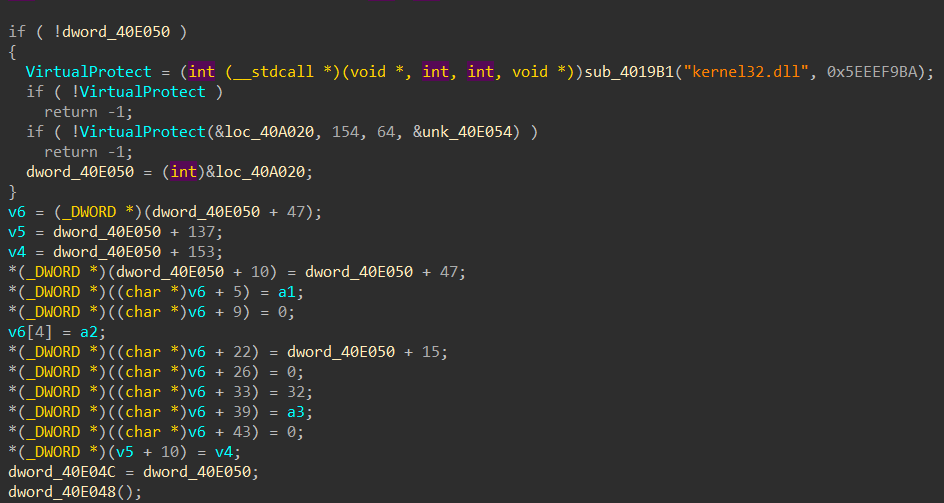

Our shellcode is stored at `unk_40A020`.

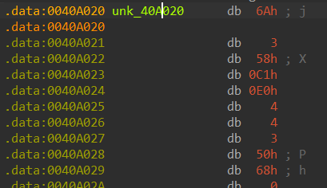

Before we analyse our shellcode, lets quickly look at `sub_402531`.

### `sub_402531`

This function gets files under `\\AppData\\Roaming\\Electrum\\wallets` and AES-256-CBC encrypts them using `openssl`. The encrypted file is then saved with the `.seraph` extension. The IV is hardcoded so  finding the key should be our next logical step. The function takes in the hex of the key and the key is the string returned by `sub_401E9D` so we can make an educated guess that our shellcode returns the key after some transformations.


## Shellcode Analysis

Lets look at the disassembly of the shellcode stored in `unk_40A020`,

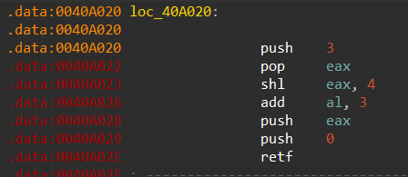

Interesting, a `retf` instruction. This part of the challenge requires further research by the player on the `retf` or `far return` instruction and the `cs` (code segment) register.

When executing a `far return` (`retf`), the processor pops the return instruction pointer (IP) from the top of the stack into the `ip` register, and then pops the segment selector (CS) from the top of the stack into the `cs` register, effecting the mode switch.

From our disassembly, we can see that the `cs` register holds the value `0x33` (after the arithmetic operations).

### The Code Segment Register

In x86 architecture, the CS register holds the segment selector for the code segment. It can have two values - `0x23` signifying `x86` instructions, and `0x33` signifying `x64` instructions. This challenge utilizes this property of the `cs` register to execute arbitrary `64-bit` code in the given `32-bit` executable. This technique is known as the **`Heaven's Gate`** technique.

## Shellcode Analysis (Continued)

Now lets look at the hex view of the shellcode:

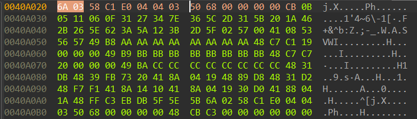

Here we see two `CB` or `retf` instructions. Lets look at the second `far return` now,

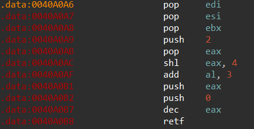

Well, now the value of the `cs` register is `0x23`, as expected the context now switches from `64bit` to `32bit`, which means the code between the two `far return`s is 64bit instructions embedded in a 32bit executable.

To summarize, there is 64-bit code getting executed in the given 32-bit executable. This technique, although pretty simple, evades the eyes of multiple antiviruses and is a malicious technique.

So now how to go ahead? The simplest way is to extract the shellcode, save it in another file and open it in 64-bit mode.

## 64bit Analysis

To analyse the shellcode, we need to save it in a different file and open it in 64 bit mode in IDA.

In the shellcode, we see the function prologue after 32 bytes, and it also so happens that the AES key required is of 32 bytes size. here is the disassembly after the 32 bytes:

```asm
seg000:0000000000000020                 push    rbx
seg000:0000000000000021                 push    rsi
seg000:0000000000000022                 push    rdi
seg000:0000000000000023                 mov     r8, 0AAAAAAAAAAAAAAAAh
seg000:000000000000002D                 mov     rcx, 19h
seg000:0000000000000034                 mov     r9, 0BBBBBBBBBBBBBBBBh
seg000:000000000000003E                 mov     rdi, 20h ; ' '
seg000:0000000000000045                 mov     r10, 0CCCCCCCCCCCCCCCCh
seg000:000000000000004F                 xor     rbx, rbx
seg000:0000000000000052
seg000:0000000000000052 loc_52:                                 ; CODE XREF: seg000:0000000000000075↓j
seg000:0000000000000052                 cmp     rbx, rdi
seg000:0000000000000055                 jnb     short loc_77
seg000:0000000000000057                 mov     al, [r9+rbx]
seg000:000000000000005B                 mov     rax, rbx
seg000:000000000000005E                 xor     rdx, rdx
seg000:0000000000000061                 div     rcx
seg000:0000000000000064                 mov     dl, [r8+rdx]
seg000:0000000000000068                 mov     al, [r9+rbx]
seg000:000000000000006C                 xor     al, dl
seg000:000000000000006E                 mov     [r10+rbx], al
seg000:0000000000000072                 inc     rbx
seg000:0000000000000075                 jmp     short loc_52
seg000:0000000000000077 ; ---------------------------------------------------------------------------
seg000:0000000000000077
seg000:0000000000000077 loc_77:                                 ; CODE XREF: seg000:0000000000000055↑j
seg000:0000000000000077                 pop     rdi
seg000:0000000000000078                 pop     rsi
seg000:0000000000000079                 pop     rbx
seg000:000000000000007A                 push    2
seg000:000000000000007C                 pop     rax
seg000:000000000000007D                 shl     eax, 4
seg000:0000000000000080                 add     al, 3
seg000:0000000000000082                 push    rax
seg000:0000000000000083                 push    0
seg000:0000000000000088                 retfq
```

Following is the annotated shellcode for better clarity:
```asm
mov r8, 0xAAAAAAAAAAAAAAAAh   ; xor_key pointer
mov rcx, 19h                  ; key_len
mov r9, 0xBBBBBBBBBBBBBBBBh   ; encrypted_data pointer
mov rdi, 20h                  ; encrypted_data size (32 bytes)
mov r10, 0xCCCCCCCCCCCCCCCCh  ; output buffer pointer
xor rbx, rbx                  ; counter = 0
```
Addresses like `0xAAAAAAAAAAAAAAAA` get patched at runtime, hence placeholder text in its hex view.

After this there is the main transformation of the encrypted data:
```asm
xor_loop:
    cmp rbx, rdi              ; if (counter >= 32)
    jnb done

    mov al, [r9+rbx]          ; encrypted_byte = encrypted_data[counter]
    mov rax, rbx
    xor rdx, rdx
    div rcx                   ; rax = counter / key_len, rdx = counter % key_len

    mov dl, [r8+rdx]          ; key_byte = xor_key[counter % key_len]
    mov al, [r9+rbx]
    xor al, dl                ; decrypted = encrypted ^ key_byte
    mov [r10+rbx], al         ; output[counter] = decrypted

    inc rbx                   ; counter++
    jmp xor_loop

```

after which the registers get popped and the cs register gets modified to return back to 32 bit mode:

```asm
done:
    pop rdi                   ; Restore saved registers
    pop rsi
    pop rbx

    push 2
    pop rax
    shl eax, 4
    add al, 3
    push rax
    push 0
    retfq                     ; far return to switch back to 32 bit mode
```

Right, so the algorithm is our classic repeating-key XOR cipher. Below is a comparison between the disassemblies in 32-bit and 64-bit mode respectively:

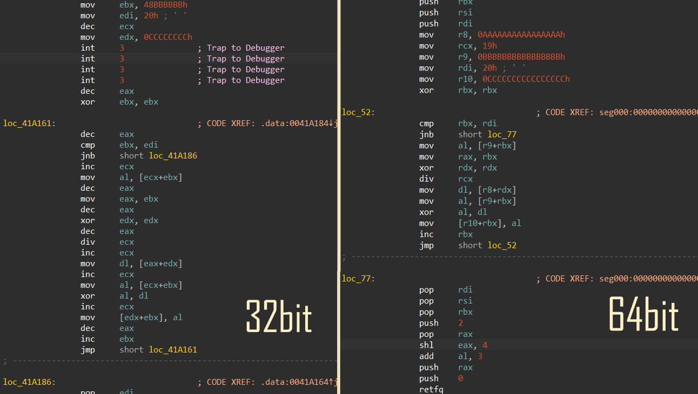

Now, we know the xor key and the encrypted bytes, that's the only two things required to get the flag:

```python
data = bytes.fromhex("0B 05 11 06 0F 31 27 34 7E 36 5C 2D 31 5B 20 1A 46 2B 26 5E 62 3A 5A 12 3B 2D 5F 02 57 00 41 08")
key = "electrum.blockstream.info"
result = bytes([data[i] ^ ord(key[i % len(key)]) for i in range(len(data))])
print(result.decode())
# nite{CRYPT0BR0Sn4NG3LS4tTH3g4t3}
```

