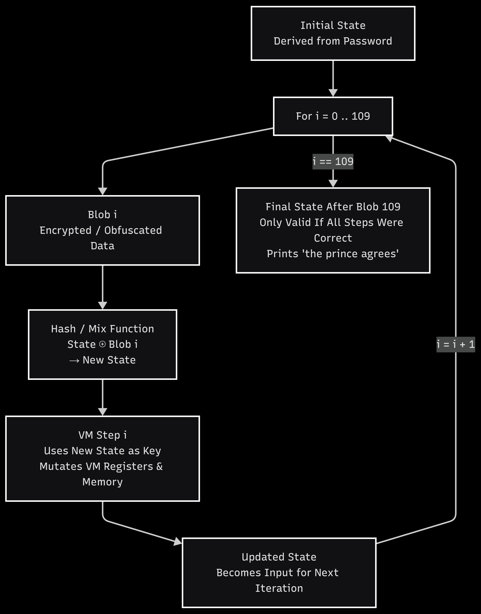

# The Gardens of Babylon Solution

**Flag:**`nite{1_4m_Th3_4RcHi73cT_0f_mY_0wN_d3strucT10n}`

This challenge is split into **two strictly sequential phases** and the second phase is **cryptographically unreachable** unless the first phase is solved correctly.

To obtain the password, the user has to bypass the anti-debug first, which would otherwise corrupt `VM_SALT` silently.

The user must find the anti-debugging functions and

1. patch `sub_1600` (the `ptrace`) which returns 0 (no debugger detected) without calling `ptrace`

2. patch `sub_1640` (tracer PID) returns 0 ( does not call `/proc/self/status`)

Once that is done, the first phase of the challenge can be solved by [this](get_password.py) Z3 script.

After the correct password `k@iL33n@W@sR16hT` is found and inputted to the binary, the prince gives his approval and the program seemingly exits without doing anything. The recovered password is used to de-shuffle the opcode mapping for a second virtual machine (VM2). This VM does **not** operate on a single encrypted payload, instead it processes ~110 encrypted blobs sequentially.

Syscalls are to be understood and an interpreter is to be made to reverse the second VM which processes the blobs sequentially -  the unique key for Block N is derived by hashing the **master key** combined with the **decrypted content of block N-1**. VM2 operates as a linear dependency chain(a custom Feistel-like network):

1. A **master key** is derived from the password.
2. Blob `0` is decrypted using a key derived from the master key.
3. Blob `1` is decrypted using:
   - the master key
   - **plus the decrypted output of blob 0**
4. Blob `N` is decrypted using:
   - the master key
   - **plus the decrypted output of blob N-1**

If any blob is decrypted incorrectly, all subsequent blobs become unrecoverable.

Oh and the fun part is that the decrypted plaintext is immediately consumed and never retained. Each iteration decrypts a single blob, uses its plaintext to advance the VM state, clears it from memory, derives the next iteration’s key via hashing, and then proceeds to the next blob.

As soon as the first blob is decrypted - the `ELF` header gives away the fact that VM2 is decrypting an entire inner binary, and only prints the success message after it has finished decrypting in the background.

There are many ways to get the decrypted blobs from this point. A skilled reverse engineer can still capture it when the decrypted bytes that comes out of Feistel decry or break before entering hash function and grab the bytes that way. The alternate way is to write an entire python emulator of VM2.

Once all blobs are obtained and concatenated, the user is left with a UPX packed binary. Upon unpacking and running, the binary spit out timestamp dependent flags that were seeded by a SplitMix64 PRNG, which generated an encrypted 40 byte keystream. The script for the crypto behind the inner binary can be found [here](solve.py)

