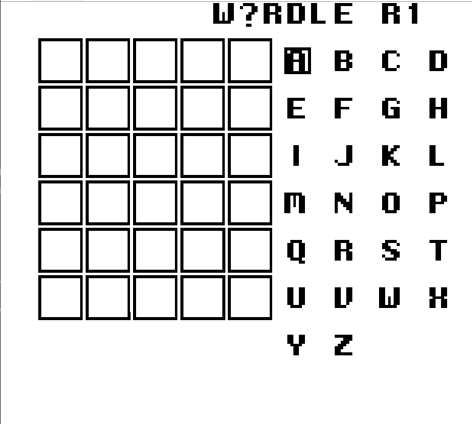
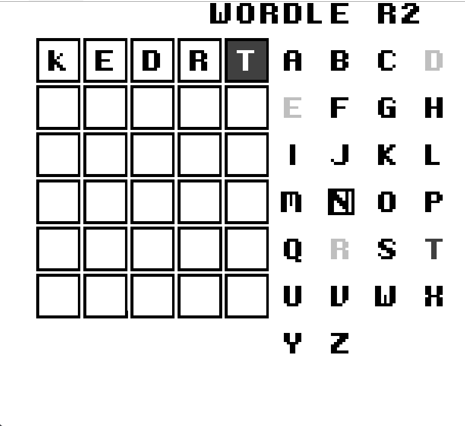
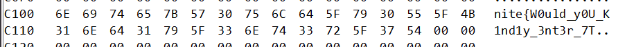
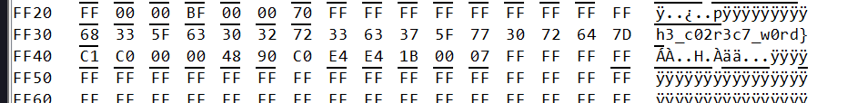

# Wordle Boy Solution

**Flag:** `nite{W0uld_y0U_K1nd1y_3nt3r_7h3_c02r3c7_w0rd}`

The game contains 3 rounds. The first two rounds are standard wordle games but the wordlist is quite small as most words are not accepted.

The third round is a flag checker that checks for flag bytes in memory against various constraints. The first two rounds can be skipped if you access the flag checker's decompilation. Regardless, I'll go through the solve without skipping it.



The game can be decompiled in ghidra using the ghidra boy plugin.

Going through the decomp a bit, `FUN_2c42` seems to be the main function.

The following is the part that initiates ROUND 1.
```c

void FUN_2c42(void)
{
  byte bVar1;
  char cVar2;
  undefined2 uVar3;
  undefined *puVar4;

  FUN_33c0(0xff47,&DAT_c16b);
  do {
    while( true ) {
      while( true ) {
        FUN_0ea0();
        cVar2 = FUN_0f5a();
        FUN_412d(&DAT_9800,0,0x400);
        uVar3 = 0;
        FUN_36e4();
        bVar1 = LCDC;
        LCDC = bVar1 | 0x80;
        FUN_01bd(uVar3);
        FUN_36a3();
        FUN_3686(&UNK_417d);
        if (cVar2 != '\0') break;
        FUN_0ef6("GAME OVER - ROUND 1");
      }
    //rest of main
```

`FUN_33c0` is memcpy and it seems to be copying the contents at 0xff47 to memory location c16b, the mem loc at 0xff47 is the `BGP` register.
`FUN_412d` acts as memset and it clears the background in this case.
`FUN_0ea0` draws the start screen.
`FUN_0f5a` is the function that actually handles round 1. It's a big function that handles the working of the wordle game.
- `FUN_4596` prints `W?RDLE R1` to the screen.
- `FUN_37cf` handles input
- if A is pressed the letter is appened to the input buffer `DAT_c0b3`, `FUN_461f` checks for the length and `FUN_0c7a` draws it to the screen
- if B is p ressed the character is cleared
- if Start is pressed, then first the length is checked to be five, then `FUN_0986` checks whether the word is in the wordlist.

```c
undefined2 FUN_0986(void)

{
  int iVar1;
  undefined2 extraout_DE;
  undefined1 auStack_6 [6];

  FUN_0541(auStack_6);
  iVar1 = 0;
  while( true ) {
    if (0xd3 < (byte)iVar1) {
      return 0;
    }
    iVar1 = FUN_462d(*(undefined2 *)(&DAT_c19f + iVar1 * 2),auStack_6);
    if ((char)((uint)extraout_DE >> 8) == '\0' && (char)extraout_DE == '\0') break;
    iVar1 = iVar1 + 1;
  }
  return 1;
}
```

Here, the loop runs from 0 to 0xd3, which implies the wordlist has 212 words. Each word is loaded and is checked for against the input in `FUN_462d`.
`FUN_0541` encrypts the input before its checked against the wordlist.
```c

byte FUN_0541(int param_1,int param_2)

{
  byte *pbVar1;
  byte bVar2;
  byte bVar3;
  char extraout_C;
  char extraout_C_00;
  char extraout_C_01;
  char extraout_C_02;
  char extraout_C_03;
  char extraout_C_04;
  undefined1 uVar4;
  undefined1 extraout_D;
  undefined1 extraout_D_00;
  undefined1 extraout_D_01;
  byte local_1;

  local_1 = 0;
  while( true ) {
    bVar2 = *(byte *)((uint)local_1 + param_2);
    pbVar1 = (byte *)((uint)local_1 + param_1);
    bVar3 = bVar2;
    if (bVar2 == 0) break;
    bVar3 = local_1 - 5;
    if (4 < local_1) break;
    uVar4 = (&DAT_c16b)[local_1 & 3];
    if ((bVar2 < 0x41) || (0x5a < bVar2)) {
      if ((bVar2 < 0x61) || (0x7a < bVar2)) {
        if ((bVar2 < 0x30) || (0x39 < bVar2)) {
          *pbVar1 = bVar2;
        }
        else {
          FUN_3323(uVar4,0xc10a);
          FUN_3323((bVar2 - 0x30) + extraout_C_03,CONCAT11(extraout_D_01,10));
          *pbVar1 = extraout_C_04 + 0x30;
        }
      }
      else {
        FUN_3323(uVar4,0xc11a);
        FUN_3323(bVar2 + 0x9f + extraout_C_01,CONCAT11(extraout_D_00,0x1a));
        *pbVar1 = extraout_C_02 + 0x61;
      }
    }
    else {
      FUN_3323(uVar4,0xc11a);
      FUN_3323(bVar2 + 0xbf + extraout_C,CONCAT11(extraout_D,0x1a));
      *pbVar1 = extraout_C_00 + 0x41;
    }
    local_1 = local_1 + 1;
  }
  *pbVar1 = 0;
  return bVar3;
}
```
`FUN_3323` acts as a 8 bit modulo function. `DAT_c16b` has a 4 byte key, from earlier we know that this stores four bytes starting from the BGP register. These values are known and are set in the entry function and can also be seen using a debugger. So the key bytes are `[0xe4,0xe4,0x1b,0]`.

The encryption routine basically takes each of the 5 characters, if its a lowercase letter it adds the respective key byte(which cycles) and rotates the character in the bounds of lowercase alphabets.

Its similar for upper case characters and for digits, the bounds for rotation are digits from 0-9. If any other character is found that dont meet these cases, the are not encryption.

Using this information we can decrypt all the words to find the full wordlist.

```python
def decrypt_word(enc_word, key):
    k = list(key)
    out_chars = []
    for i, ch in enumerate(enc_word):
        kb = k[i % len(k)]
        if 'A' <= ch <= 'Z':
            shift = kb % 26
            plain = chr((ord(ch) - ord('A') - shift) % 26 + ord('A'))
        elif 'a' <= ch <= 'z':
            shift = kb % 26
            plain = chr((ord(ch) - ord('a') - shift) % 26 + ord('a'))
        elif '0' <= ch <= '9':
            shift = kb % 10
            plain = chr((ord(ch) - ord('0') - shift) % 10 + ord('0'))
        else:
            plain = ch
        out_chars.append(plain)
    return "".join(out_chars)
```

Memory at `0xC377` contains the encrypted target, this can be decrypted and round 1 can be solved.

Round 2 is similar and is contained in `FUN_1368` but when you decrypt the word at `c377` you get `PATCH` which isnt in the wordlist. Additionally, entering a valid word, seems to perform transforms on them.
This can be seen here:
```c
if ((char)((uint)uVar9 >> 8) != '\0' || (char)uVar9 != '\0') {
    input_buffer = input_buffer ^ 0x13;
    DAT_c0b7 = DAT_c0b7 ^ 0x25;
    DAT_c0b5 = DAT_c0b5 ^ 1;
    for (bVar3 = 0; bVar3 < 2; bVar3 = bVar3 + 1) {
    uVar6 = (&input_buffer)[bVar3];
    puVar8 = (undefined1 *)CONCAT11((0x4c < (byte)(-bVar3 + 4)) + -0x40,-bVar3 + -0x49);
    (&input_buffer)[bVar3] = *puVar8;
    *puVar8 = uVar6;
}
```

The first character of the input is xored with 0x13, third with 0x1 and fifth with 0x25. Then the word is reversed.



For example `GREEN` becomes `keDRT`.

To solve the round, enter any valid word to see the transformed result. Encrypt the result using the logic found earlier and replace the encrypted target with this in memory using a dynamic memory editor(I use emulicious). Then entering the valid word, would pass the round.

The third round is a flag checker(in `FUN_2bad`) that checks for various constraints that are in `FUN_1735`. The constraints take 29 bytes from `C100` and 16 bytes from `FF30` which combine to form the 45 character flag. Constraints are modelled in 64 bit arithmetic, and also uses the key bytes(4 bytes starting at the BGP register) as constants. `FUN_3323` from before is used on certain constants as well. To solve, the required flag bytes in memory should be treated as symbolic and a SMT solver needs to be used.

The constraints are quite complex to look at so it is important to simplify them(this is why representing them as 64 bit numbers makes things a lot easier).

```c
  local_c._0_1_ = local_4a;
  local_c._1_1_ = 0;
  local_a = 0;
  local_6._0_1_ = 0;
  local_6._1_1_ = 0;
  cVar8 = '\x18';
  do {
    uVar7 = local_a;
    bVar11 = (byte)local_c >> 7;
    local_c._0_1_ = (byte)local_c << 1;
    local_12 = local_c._1_1_ >> 7;
    local_c._1_1_ = local_c._1_1_ << 1 | bVar11;
    local_12 = (byte)local_a << 1 | local_12;
    bVar11 = local_a._1_1_ >> 7;
    local_11 = local_a._1_1_ << 1 | (byte)local_a >> 7;
    local_a._0_2_ = CONCAT11(local_11,local_12);
    local_a._2_1_ = SUB41(uVar7,2);
    bVar9 = local_a._2_1_ >> 7;
    bVar11 = local_a._2_1_ << 1 | bVar11;
    local_a._3_1_ = SUB41(uVar7,3);
    local_a._0_3_ = CONCAT12(bVar11,(uint)local_a);
    bVar10 = local_a._3_1_ >> 7;
    bVar9 = local_a._3_1_ << 1 | bVar9;
    local_a = CONCAT13(bVar9,(int3)local_a);
    bVar12 = (byte)local_6 >> 7;
    local_6._0_1_ = (byte)local_6 << 1 | bVar10;
    local_6._1_1_ = local_6._1_1_ << 1 | bVar12;
    cVar8 = cVar8 + -1;
  } while (cVar8 != '\0');
  local_14 = (byte)local_c ^ 0xab;
  local_13 = local_c._1_1_ ^ 0x15;
  local_12 = local_12 ^ 0x2d;
  local_11 = local_11 ^ 0x3f;
  if (((((local_14 != (byte)(local_27 + 0x39)) || (local_13 != (byte)((0xc6 < local_27) + 0x15U) ))
       || (local_12 != 0x2d)) || ((local_11 != 0x4a || (bVar11 != 0)))) ||
     ((bVar9 != 0 || (((byte)local_6 != 0 || (local_6._1_1_ != 0)))))) {
    DAT_c16a = 0;
  }
```

from the decomp

can be simplified to in z3
```python
(local_51[7] << 0x18) ^ BitVecVal(0x3f2d15ab,64) == BitVecVal((0x4a2d1539651a >> 0x10),64) + local_51[42]
```
This is also necessary as operations in C and python/z3 behave differently so abstracting makes stuff a lot easier.

```c
  bVar11 = LCDC;
  if ((bool)(bVar11 >> 7)) {
    bVar11 = STAT;
    while ((bVar11 & 3) != 3) {
      bVar11 = STAT;
    }
  }
  if (local_27 != 0x72) {
    DAT_c16a = 0;
  }
  local_a = (ulong)CONCAT11(SUB21(local_51._0_2_,1),DAT_8000);
  local_6 = (uint)DAT_fe00 << 8;
```
The constsraints use the first vram and oam byte for the constraints as given above. But since the above code checks that the PPU is in mode 3, these bytes cannot actually be read. Therefore they both contain the values `0xff`.

Using this information the constraints can be formed and solved using a SMT solver like z3. This gives the flag.

[z3 solve script](solve.py)

Inserting them at the right location should give the flag approved message on enter.

Additionally, instead of modelling the constraints, the flag can be retrieved by a small emulation of the cpu and using that in a smt solver like z3.






